

  
  

<b>Universidad Peruana de Ciencias Aplicadas</b>  
Ingeniería de Software  
8vo Ciclo 

<b>Arquitecturas de Software Emergentes</b>  
Sección: 11806 

Profesor: Christian Luis De Los Rios Fernandez 

<b>"INFORME DEL TRABAJO FINAL – TB1"</b>

Startup: <b>Oxaira</b>  
Producto: <b>AirQ</b> 

<b>Integrantes:</b>

<table style="margin-left:auto; margin-right:auto; border-collapse:collapse;">
<tr>
<th style="border:1px solid black; padding:8px;">Apellidos y Nombres</th>
<th style="border:1px solid black; padding:8px;">Código</th>
</tr>

<tr>
<td style="border:1px solid black; padding:8px;">Eduardo Eusebio Sihuar Ccotarma Ttito</td>
<td style="border:1px solid black; padding:8px;">U20211c736</td>
</tr>

<tr>
<td style="border:1px solid black; padding:8px;">Daniel Jhared Chávarri Zarzosa</td>
<td style="border:1px solid black; padding:8px;">U202211108</td>
</tr>

<tr>
<td style="border:1px solid black; padding:8px;">Marco Antonio Gongora Sanchez</td>
<td style="border:1px solid black; padding:8px;">U20211A085</td>
</tr>

<tr>
<td style="border:1px solid black; padding:8px;">Andres Fernando Rodriguez Zuluoeta</td>
<td style="border:1px solid black; padding:8px;">U20212421</td>
</tr>

<tr>
<td style="border:1px solid black; padding:8px;">Erick Armando Cueva Elera</td>
<td style="border:1px solid black; padding:8px;">U201910151</td>
</tr>

</table>

  

Abril, 2026

# Registro de Versiones del Informe

A continuación se detallan los avances y las modificaciones relevantes realizadas durante el desarrollo del proyecto **AirQ**, propuesta de solución basada en **IoT + Machine Learning** para la optimización y monitoreo inteligente de la calidad del aire. Esta sección evidencia la participación activa del equipo en el desarrollo del informe correspondiente al hito TB1.

 

<table style="margin-left:auto; margin-right:auto; border-collapse:collapse; width:90%;">

<tr>
<th style="border:1px solid black; padding:10px;">Versión</th>
<th style="border:1px solid black; padding:10px;">Fecha</th>
<th style="border:1px solid black; padding:10px;">Autor</th>
<th style="border:1px solid black; padding:10px;">Descripción de modificación</th>
</tr>

<tr>
<td style="border:1px solid black; padding:10px;"><b>TB1</b></td>

<td style="border:1px solid black; padding:10px;">Abril, 2026</td>

<td style="border:1px solid black; padding:10px;">
<ul>
<li>Eduardo Eusebio Sihuar Ccotarma Ttito</li>
<li>Daniel Jhared Chávarri Zarzosa</li>
<li>Marco Antonio Gongora Sanchez</li>
<li>Andres Fernando Rodriguez Zuluoeta</li>
<li>Erick Armando Cueva Elera</li>
</ul>
</td>

<td style="border:1px solid black; padding:10px;">
Se han desarrollado e incorporado los siguientes componentes del informe del proyecto:

<ul>
<li><b>Capítulo I: Introducción</b>
  <ul>
    <li>Startup Profile</li>
    <li>Solution Profile</li>
    <li>Segmentos objetivo</li>
  </ul>
</li>

<li><b>Capítulo II: Requirements Elicitation & Analysis</b>
  <ul>
    <li>Identificación de competidores</li>
    <li>Diseño y análisis de entrevistas</li>
    <li>Needfinding (User Personas, Empathy Map, As-Is)</li>
  </ul>
</li>

<li><b>Capítulo III: Requirements Specification</b>
  <ul>
    <li>To-Be Scenario Mapping</li>
    <li>User Stories</li>
    <li>Impact Mapping</li>
    <li>Product Backlog inicial</li>
  </ul>
</li>

<li><b>Capítulo IV: Strategic-Level Software Design</b>
  <ul>
    <li>Definición de drivers arquitectónicos</li>
    <li>Attribute-Driven Design (ADD)</li>
    <li>Introducción a Domain-Driven Design (DDD)</li>
    <li>Diagramas iniciales de arquitectura</li>
  </ul>
</li>

<li>Definición de la propuesta tecnológica basada en <b>IoT + Machine Learning</b> para el monitoreo y predicción de calidad del aire.</li>

<li>Construcción de la estructura base del repositorio en GitHub bajo buenas prácticas (GitFlow y commits).</li>

</ul>
</td>

</tr>

</table>

 

# Project Report Collaboration Insights

A continuación se detalla el nivel de participación del equipo en la elaboración del informe del proyecto **AirQ**, desarrollado en un repositorio colaborativo bajo control de versiones (GitHub), evidenciando el aporte de cada integrante durante el hito TB1.

 

Repositorio del Project Report: 
<a href="https://github.com/TF-1ASI0728-202610-TF/Report">
https://github.com/TF-1ASI0728-202610-TF/Report
</a>

 

<table style="margin-left:auto; margin-right:auto; border-collapse:collapse; width:90%;">

<tr>
<th style="border:1px solid black; padding:10px;">Versión</th>
<th style="border:1px solid black; padding:10px;">Fecha</th>
<th style="border:1px solid black; padding:10px;">Participación del equipo</th>
</tr>

<tr>

<td style="border:1px solid black; padding:10px;"><b>TB1</b></td>

<td style="border:1px solid black; padding:10px;">Abril, 2026</td>

<td style="border:1px solid black; padding:10px;">

<ul>

<li><b>Eduardo Eusebio Sihuar Ccotarma Ttito:</b> 
Se encargó de la estructuración inicial del documento del proyecto en GitHub, definiendo la organización del README.md, la tabla de contenidos y la estandarización del formato del informe. Apoyó en la redacción del <b>Capítulo I (Startup Profile)</b> y en la definición del enfoque del sistema basado en IoT.</li>

 

<li><b>Daniel Jhared Chávarri Zarzosa:</b> 
Participó en el desarrollo del <b>Solution Profile</b>, definiendo la problemática relacionada con la calidad del aire y el uso de sensores IoT. Contribuyó en la elaboración del <b>Lean UX Process</b> (Problem Statements, Assumptions e Hypothesis) y en la identificación de requerimientos iniciales del sistema.</li>

 

<li><b>Marco Antonio Gongora Sanchez:</b> 
Desarrolló el análisis de <b>competidores</b> y apoyó en la sección de <b>Requirements Elicitation & Analysis</b>, incluyendo entrevistas y análisis de necesidades. Contribuyó en la construcción de <b>User Personas</b> y <b>Empathy Maps</b>.</li>

 

<li><b>Andres Fernando Rodriguez Zuluoeta:</b> 
Participó en la elaboración de <b>User Stories</b>, <b>Impact Mapping</b> y <b>Product Backlog</b>. Apoyó en la definición de escenarios <b>As-Is y To-Be</b>, alineando los requerimientos con la solución basada en Machine Learning.</li>

 

<li><b>Erick Armando Cueva Elera:</b> 
Se encargó de la introducción al diseño arquitectónico, participando en la definición de <b>drivers arquitectónicos</b>, <b>Attribute-Driven Design (ADD)</b> y conceptos iniciales de <b>Domain-Driven Design (DDD)</b>. Apoyó en la elaboración de diagramas iniciales de arquitectura del sistema AirQ.</li>

</ul>

</td>

</tr>

</table>

 

# Contenido

## Tabla de Contenidos

### [Registro de Versiones del Informe](#registro-de-versiones-del-informe)
### [Project Report Collaboration Insights](#project-report-collaboration-insights)
### [Student Outcome](#student-outcome)
---

## [Capítulo I: Introducción](#capítulo-i-introducción-1)

- [1.1. Startup Profile](#11-startup-profile)
  - [1.1.1. Descripción de la Startup](#111-descripción-de-la-startup)
  - [1.1.2. Perfiles de integrantes del equipo](#112-perfiles-de-integrantes-del-equipo)

- [1.2. Solution Profile](#12-solution-profile)
  - [1.2.1. Antecedentes y problemática](#121-antecedentes-y-problemática)
  - [1.2.2. Lean UX Process](#122-lean-ux-process)
    - [1.2.2.1. Lean UX Problem Statements](#1221-lean-ux-problem-statements)
    - [1.2.2.2. Lean UX Assumptions](#1222-lean-ux-assumptions)
    - [1.2.2.3. Lean UX Hypothesis Statements](#1223-lean-ux-hypothesis-statements)
    - [1.2.2.4. Lean UX Canvas](#1224-lean-ux-canvas)

- [1.3. Segmentos objetivo](#13-segmentos-objetivo)

---

## [Capítulo II: Requirements Elicitation & Analysis](#capítulo-ii-requirements-elicitation--analysis-1)

- [2.1. Competidores](#21-competidores)
  - [2.1.1. Análisis competitivo](#211-análisis-competitivo)
  - [2.1.2. Estrategias y tácticas frente a competidores](#212-estrategias-y-tácticas-frente-a-competidores)

- [2.2. Entrevistas](#22-entrevistas)
  - [2.2.1. Diseño de entrevistas](#221-diseño-de-entrevistas)
  - [2.2.2. Registro de entrevistas](#222-registro-de-entrevistas)
  - [2.2.3. Análisis de entrevistas](#223-análisis-de-entrevistas)

- [2.3. Needfinding](#23-needfinding)
  - [2.3.1. User Personas](#231-user-personas)
  - [2.3.2. User Task Matrix](#232-user-task-matrix)
  - [2.3.3. Empathy Mapping](#233-empathy-mapping)
  - [2.3.4. As-is Scenario Mapping](#234-as-is-scenario-mapping)

- [2.4. Ubiquitous Language](#24-ubiquitous-language)

---

## [Capítulo III: Requirements Specification](#capítulo-iii-requirements-specification-1)

- [3.1. To-Be Scenario Mapping](#31-to-be-scenario-mapping)
- [3.2. User Stories](#32-user-stories)
- [3.3. Impact Mapping](#33-impact-mapping)
- [3.4. Product Backlog](#34-product-backlog)

---

## [Capítulo IV: Strategic-Level Software Design](#capítulo-iv-strategic-level-software-design-1)

### [4.1. Strategic-Level Attribute-Driven Design](#41-strategic-level-attribute-driven-design)
- [4.1.1. Design Purpose](#411-design-purpose)
- [4.1.2. Attribute-Driven Design Inputs](#412-attribute-driven-design-inputs)
  - [4.1.2.1. Primary Functionality](#4121-primary-functionality)
  - [4.1.2.2. Quality Attribute Scenarios](#4122-quality-attribute-scenarios)
  - [4.1.2.3. Constraints](#4123-constraints)
- [4.1.3. Architectural Drivers Backlog](#413-architectural-drivers-backlog)
- [4.1.4. Architectural Design Decisions](#414-architectural-design-decisions)
- [4.1.5. Quality Attribute Scenario Refinements](#415-quality-attribute-scenario-refinements)

### [4.2. Strategic-Level Domain-Driven Design](#42-strategic-level-domain-driven-design)
- [4.2.1. EventStorming](#421-eventstorming)
- [4.2.2. Candidate Context Discovery](#422-candidate-context-discovery)
- [4.2.3. Domain Message Flows Modeling](#423-domain-message-flows-modeling)
- [4.2.4. Bounded Context Canvases](#424-bounded-context-canvases)
- [4.2.5. Context Mapping](#425-context-mapping)

### [4.3. Software Architecture](#43-software-architecture)
- [4.3.1. Software Architecture System Landscape Diagram](#431-software-architecture-system-landscape-diagram)
- [4.3.2. Software Architecture Context Level Diagrams](#432-software-architecture-context-level-diagram)
- [4.3.3. Software Architecture Container Level Diagrams](#433-software-architecture-container-level-diagram)
- [4.3.4. Software Architecture Deployment Diagrams](#434-software-architecture-deployment-diagram)

---

## [Capítulo V: Tactical-Level Software Design](#capítulo-v-tactical-level-software-design)

- [5.X. Bounded Context](#5x-bounded-context)
  - [Domain Layer](#domain-layer)
  - [Interface Layer](#interface-layer)
  - [Application Layer](#application-layer)
  - [Infrastructure Layer](#infrastructure-layer)
  - [Component Diagrams](#component-diagrams)
  - [Code Level Diagrams](#code-level-diagrams)

---

## [Capítulo VI: Solution UX Design](#capítulo-vi-solution-ux-design)

- [6.1. Style Guidelines](#61-style-guidelines)
- [6.2. Information Architecture](#62-information-architecture)
- [6.3. Landing Page UI Design](#63-landing-page-ui-design)
- [6.4. Applications UX/UI Design](#64-applications-uxui-design)
- [6.5. Prototyping](#65-prototyping)

---

## [Capítulo VII: Product Implementation, Validation & Deployment](#capítulo-vii-product-implementation-validation--deployment)

- [7.1. Software Configuration Management](#71-software-configuration-management)
- [7.2. Solution Implementation](#72-solution-implementation)
- [7.3. Validation Interviews](#73-validation-interviews)
- [7.4. Video About-the-Product](#74-video-about-the-product)

---

## [Conclusiones](#conclusiones)
## [Bibliografía](#bibliografía)
## [Anexos](#anexos)

# Student Outcome

El curso contribuye al cumplimiento del Student Outcome ABET:

<b>ABET – EAC - Student Outcome 3</b> 
Capacidad de comunicarse efectivamente con un rango de audiencias.

<b>Criterio:</b> Capacidad de comunicarse efectivamente de forma oral y escrita en el contexto del desarrollo de soluciones de ingeniería.

En el siguiente cuadro se describen las acciones realizadas por cada integrante del equipo y las conclusiones obtenidas, las cuales evidencian el logro del Student Outcome durante el desarrollo del proyecto <b>AirQ</b>, solución basada en <b>IoT + Machine Learning</b> para el monitoreo inteligente de la calidad del aire.

<table style="margin-left:auto; margin-right:auto; border-collapse:collapse; width:95%;">

<tr>
<th style="border:1px solid black; padding:10px;">Criterio Específico</th>
<th style="border:1px solid black; padding:10px;">Acciones Realizadas</th>
<th style="border:1px solid black; padding:10px;">Conclusiones</th>
</tr>

<!-- CRITERIO 1 -->
<tr>

<td style="border:1px solid black; padding:10px;">
Comunica oralmente sus ideas y/o resultados con objetividad a público de diferentes especialidades y niveles jerárquicos, en el marco del desarrollo de un proyecto en ingeniería.
</td>

<td style="border:1px solid black; padding:10px;">

<b>TB1</b>

<ul>

<li><b>Eduardo Eusebio Sihuar Ccotarma Ttito:</b> 
Expuso la estructura general del proyecto y el enfoque basado en IoT, comunicando de manera clara la organización del sistema.</li>

<li><b>Daniel Jhared Chávarri Zarzosa:</b> 
Explicó la problemática de la calidad del aire y el uso de Machine Learning para predicción de datos.</li>

<li><b>Marco Antonio Gongora Sanchez:</b> 
Presentó los resultados de entrevistas y análisis de competidores, comunicando insights clave del usuario.</li>

<li><b>Andres Fernando Rodriguez Zuluoeta:</b> 
Sustentó los requerimientos mediante User Stories e Impact Mapping.</li>

<li><b>Erick Armando Cueva Elera:</b> 
Explicó los fundamentos del diseño arquitectónico (ADD y DDD).</li>

</ul>

</td>

<td style="border:1px solid black; padding:10px;">

<ul>

<li>El equipo logró comunicar ideas de forma clara, estructurada y adaptada a distintos tipos de audiencia.</li>

<li>Se evidenció dominio técnico en IoT, Machine Learning y arquitectura de software.</li>

<li>Se fortalecieron habilidades de exposición, síntesis y argumentación técnica.</li>

</ul>

</td>

</tr>

<!-- CRITERIO 2 -->
<tr>

<td style="border:1px solid black; padding:10px;">
Comunica en forma escrita ideas y/o resultados con objetividad a público de diferentes especialidades y niveles jerárquicos, en el marco del desarrollo de un proyecto en ingeniería.
</td>

<td style="border:1px solid black; padding:10px;">

<b>TB1</b>

<ul>

<li><b>Eduardo Eusebio Sihuar Ccotarma Ttito:</b> 
Redactó la estructura del informe y la organización del README.md.</li>

<li><b>Daniel Jhared Chávarri Zarzosa:</b> 
Desarrolló la redacción del Solution Profile y Lean UX.</li>

<li><b>Marco Antonio Gongora Sanchez:</b> 
Documentó entrevistas, análisis competitivo y User Personas.</li>

<li><b>Andres Fernando Rodriguez Zuluoeta:</b> 
Redactó User Stories, Impact Mapping y Product Backlog.</li>

<li><b>Erick Armando Cueva Elera:</b> 
Documentó el diseño arquitectónico y los drivers arquitectónicos.</li>

</ul>

</td>

<td style="border:1px solid black; padding:10px;">

<ul>

<li>El informe presenta una estructura clara, coherente y bien organizada.</li>

<li>Se utilizó un lenguaje técnico adecuado, comprensible para distintos públicos.</li>

<li>Se logró documentar correctamente los procesos, requerimientos y diseño del sistema.</li>

<li>Se fortalecieron habilidades de redacción técnica y documentación profesional.</li>

</ul>

</td>

</tr>

</table>

 
</ul>

</td>

</tr>

</table>

 

# CAPÍTULO I: INTRODUCCIÓN

## 1.1 Startup Profile

### 1.1.1 Descripción de la Startup

**Oxaira** es una startup tecnológica enfocada en el desarrollo de soluciones innovadoras mediante el uso de **Internet of Things (IoT)** y **Machine Learning (ML)**, orientadas a mejorar la calidad de vida de las personas en entornos urbanos.

La organización nace ante la creciente necesidad de contar con herramientas tecnológicas que permitan **monitorear, analizar y actuar sobre variables ambientales en tiempo real**, especialmente en contextos donde la salud y el bienestar se ven afectados por condiciones invisibles como la calidad del aire.

Oxaira propone soluciones accesibles, escalables y centradas en el usuario, integrando dispositivos inteligentes con plataformas digitales que permiten transformar datos en decisiones. Su enfoque combina:

- Captura de datos mediante sensores IoT  
- Procesamiento y análisis mediante modelos inteligentes  
- Visualización mediante aplicaciones web y móviles  

Dentro de este marco, se desarrolla **AirQ**, un sistema que permite el monitoreo continuo de la calidad del aire en espacios cerrados, contribuyendo a la prevención de enfermedades y a la mejora del bienestar general.

---

### 1.1.2 Perfiles de integrantes del equipo

<table style="width:100%; border-collapse:collapse; text-align:center;">
<tr>
<th>Foto</th>
<th>Nombre</th>
<th>Código</th>
<th>Perfil Profesional</th>
</tr>

<tr>
<td></td>
<td>Eduardo Eusebio Sihuar Ccotarma Ttito</td>
<td>U20211c736</td>
<td>Estudiante de Ingeniería de Software con enfoque en estructuración de soluciones tecnológicas, gestión de proyectos y documentación técnica. Interesado en el desarrollo de sistemas basados en IoT.</td>
</tr>

<tr>
<td></td>
<td>Daniel Jhared Chávarri Zarzosa</td>
<td>U202211108</td>
<td>Estudiante de Ingeniería de Software con experiencia en desarrollo backend y análisis de requerimientos. Interesado en la aplicación de Machine Learning y tecnologías emergentes.</td>
</tr>

<tr>
<td></td>
<td>Marco Antonio Gongora Sanchez</td>
<td>U20211A085</td>
<td>Estudiante enfocado en análisis de negocio, investigación de usuarios y diseño centrado en el usuario. Experiencia en entrevistas y levantamiento de información.</td>
</tr>

<tr>
<td></td>
<td>Andres Fernando Rodriguez Zuluoeta</td>
<td>U202124213</td>
<td>Estudiante con orientación a metodologías ágiles y desarrollo de software. Experiencia en definición de requerimientos y modelado de soluciones.</td>
</tr>

<tr>
<td></td>
<td>Erick Armando Cueva Elera</td>
<td>U201910151</td>
<td>Estudiante enfocado en arquitectura de software, diseño de sistemas escalables y aplicación de patrones como Domain-Driven Design (DDD) y Attribute-Driven Design (ADD).</td>
</tr>

</table>

---

## 1.2 Solution Profile

**AirQ** es una solución tecnológica que integra **dispositivos IoT y algoritmos de Machine Learning** para monitorear, analizar y predecir la calidad del aire en espacios cerrados.

El sistema está compuesto por:

- Sensores IoT que capturan datos ambientales (PM2.5, CO₂, temperatura, humedad)
- Un backend que procesa la información en tiempo real
- Modelos de Machine Learning para identificar patrones y generar predicciones
- Una aplicación web/móvil que permite visualizar datos mediante dashboards y alertas

AirQ permite transformar datos en acciones, brindando a los usuarios la capacidad de tomar decisiones inmediatas que impactan directamente en su salud y bienestar.

---

### 1.2.1 Antecedentes y problemática

La ciudad de Lima presenta altos niveles de contaminación ambiental, lo cual afecta significativamente la salud de sus habitantes, especialmente en espacios cerrados donde la ventilación es limitada.

Los principales problemas identificados son:

- Falta de soluciones accesibles para monitorear la calidad del aire en interiores  
- Ausencia de información en tiempo real para la toma de decisiones  
- Baja conciencia sobre el impacto de la contaminación en la salud  

Estos problemas afectan a múltiples actores:

- Hogares → exposición constante a contaminantes  
- Instituciones educativas → impacto en concentración y salud  
- Empresas → reducción de productividad  
- Centros de salud → incremento de enfermedades respiratorias  

---

### 1.2.2 Lean UX Process

#### 1.2.2.1 Problem Statements

Actualmente, los usuarios no cuentan con herramientas accesibles que les permitan conocer la calidad del aire en espacios cerrados en tiempo real. Esto genera exposición prolongada a contaminantes sin conocimiento ni capacidad de reacción.

Asimismo, la falta de información clara y comprensible limita la toma de decisiones preventivas, incrementando riesgos en la salud.

---

#### 1.2.2.2 Assumptions

Se asume que:

- Los usuarios adoptarán la solución si es fácil de usar y accesible económicamente  
- Las instituciones valorarán soluciones que mejoren bienestar y productividad  
- La información en tiempo real influirá en el comportamiento del usuario  
- La integración IoT + ML es viable técnica y económicamente  

---

#### 1.2.2.3 Hypothesis Statements

- Si los usuarios tienen acceso a información en tiempo real, reducirán su exposición a contaminantes  
- Si los datos se presentan de forma visual e intuitiva, facilitarán la toma de decisiones  
- Si el sistema es modular, permitirá una adopción progresiva en distintos contextos  

---

#### 1.2.2.4 Lean UX Canvas 
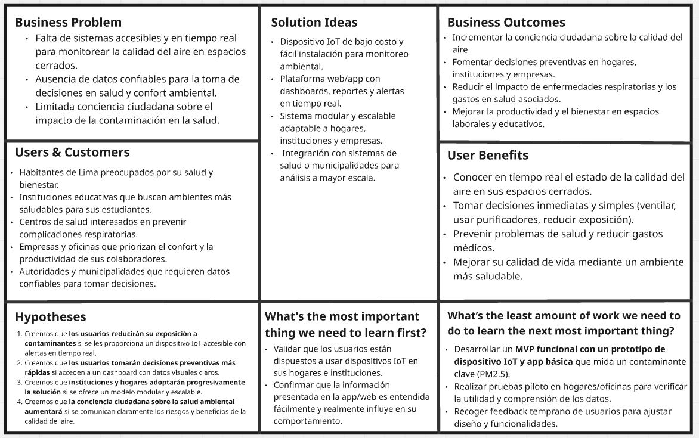

---

## 1.3 Segmentos objetivo
Para el desarrollo de AirQ se han identificado dos segmentos objetivos principales que orientarán la validación del problema y de la propuesta de valor:

### 1. Instituciones educativas

- **Perfil:** Colegios, universidades e institutos donde estudiantes y docentes pasan varias horas en aulas cerradas con escasa ventilación. La comunidad educativa está expuesta a altos niveles de dióxido de carbono y condiciones ambientales que afectan la concentración y la salud. 
- **Necesidades:** Contar con herramientas que permitan monitorear la calidad del aire en tiempo real dentro de las aulas, especialmente niveles de CO₂, humedad y temperatura, con alertas que faciliten decisiones rápidas para ventilar o activar sistemas de purificación.  
- **Motivación:** Mejorar el rendimiento académico, proteger la salud de los estudiantes y docentes, y crear conciencia sobre la importancia del aire limpio en espacios donde se pasa gran parte del día.

### 2. Instituciones corporativas
- **Perfil:** Empresas que operan en oficinas cerradas donde los colaboradores permanecen largas jornadas expuestos a aire viciado por falta de ventilación o exceso de uso de aire acondicionado. Se trata de organizaciones que buscan cuidar la salud y productividad de sus empleados.  
- **Necesidades:** Disponer de un sistema confiable que muestre indicadores de calidad del aire, emita alertas preventivas y genere reportes para respaldar la toma de decisiones de infraestructura y salud ocupacional.  
- **Motivación:** Incrementar el bienestar y la productividad laboral, reducir el ausentismo por problemas de salud asociados al aire interior y demostrar compromiso con el cuidado del ambiente laboral.

---

# CAPÍTULO II: REQUIREMENTS ELICITATION & ANALYSIS

---

## 2.1. Competidores

El mercado de soluciones de monitoreo de calidad del aire presenta diversas alternativas que abordan el problema desde distintos enfoques tecnológicos y de negocio. En este contexto, se han identificado como principales competidores a Awair, Oizom y Kaiterra.

El análisis de estos competidores permite comprender el estado actual del mercado, identificar oportunidades de diferenciación y definir una propuesta de valor alineada a las necesidades de Latinoamérica.

---

### 2.1.1. Análisis competitivo

<table border="1">
  <thead>
    <tr>
      <th colspan="2">¿Por qué llevar a cabo este análisis?</th>
      <td colspan="4">
        El análisis competitivo es fundamental para comprender el entorno en el que se insertará AirQ, 
        identificar brechas en el mercado, entender qué hacen bien los competidores y cómo diferenciarnos. 
        A partir de esta evaluación, se pueden diseñar estrategias de producto, marketing y expansión más efectivas, 
        alineadas a las necesidades de colegios y empresas en Latinoamérica.
      </td>
    </tr>
    <tr>
      <th colspan="2">Competidores</th>
      <th>
        AirQ 
        
      </th>
      <th>
        Awair 
        
      </th>
      <th>
        Oizom 
        
      </th>
      <th>
        Kaiterra 
        
      </th>
    </tr>
  </thead>
  <tbody>
    <tr>
      <th rowspan="2">Perfil</th>
      <td>Overview</td>
      <td>
        Sistema integral de monitoreo de aire para instituciones educativas y empresas en Latinoamérica. 
        Combina hardware propio con plataforma web y app móvil que emite alertas y protocolos de acción.
      </td>
      <td>
        Dispositivos inteligentes para medir calidad del aire en interiores, enfocados en escuelas y hogares. 
        Ofrece métricas de CO₂, humedad y temperatura.
      </td>
      <td>
        Sensores ambientales modulares para monitoreo en exteriores e interiores. 
        Usado en escuelas, universidades y proyectos urbanos.
      </td>
      <td>
        Monitores premium de calidad del aire para oficinas y corporaciones, 
        con dashboards de gestión y soporte para certificaciones WELL/LEED.
      </td>
    </tr>
    <tr>
      <td>Ventaja competitiva ¿Qué valor ofrece a los clientes?</td>
      <td>
        Protocolos de acción inmediata. 
        Interfaz amigable para estudiantes, docentes y trabajadores.
      </td>
      <td>
        Equipos compactos y fáciles de usar. 
        Enfoque educativo para mejorar concentración y salud en aulas.
      </td>
      <td>
        Amplia modularidad y escalabilidad. 
        Capacidad de integrar múltiples estaciones y datos urbanos.
      </td>
      <td>
        Alta precisión y confiabilidad. 
        Reconocido en corporaciones globales. 
        Soporte a certificaciones de sostenibilidad.
      </td>
    </tr>
    <tr>
      <th rowspan="2">Perfil de Marketing</th>
      <td>Mercado objetivo</td>
      <td>Colegios, universidades e instituciones corporativas en Latinoamérica.</td>
      <td>Escuelas y hogares, principalmente en EE. UU.</td>
      <td>Escuelas, universidades, ciudades inteligentes y gobiernos.</td>
      <td>Empresas, oficinas corporativas y constructoras internacionales.</td>
    </tr>
    <tr>
      <td>Estrategias de marketing</td>
      <td>
        Alianzas con instituciones educativas y empresas locales. 
        Campañas de concientización ambiental. 
        Precios accesibles para mercados emergentes.
      </td>
      <td>
        Campañas en salud y educación. 
        Marketing B2C con enfoque en bienestar.
      </td>
      <td>
        Proyectos con gobiernos y universidades. 
        Enfoque B2B y B2G.
      </td>
      <td>
        Alianzas con corporaciones y constructoras. 
        Certificaciones internacionales como herramienta de venta.
      </td>
    </tr>
    <tr>
      <th rowspan="3">Perfil de producto</th>
      <td>Productos & Servicios</td>
      <td>
        Hardware de bajo costo + plataforma web y móvil. 
        Alertas en tiempo real. 
        Protocolos de acción inmediatos.
      </td>
      <td>Monitores de aire compactos con app móvil.</td>
      <td>Sensores ambientales modulares y paneles de datos.</td>
      <td>Dispositivos premium y dashboards para empresas.</td>
    </tr>
    <tr>
      <td>Precios & Costos</td>
      <td>
        Modelo accesible, pensado para instituciones con presupuesto limitado. 
        Licencias escalables.
      </td>
      <td>Precio elevado en relación al mercado educativo latinoamericano.</td>
      <td>Costos altos de instalación e infraestructura.</td>
      <td>Precios premium para corporaciones internacionales.</td>
    </tr>
    <tr>
      <td>Canales de distribución (Web y/o Móvil)</td>
      <td>App móvil y Web con soporte local.</td>
      <td>App móvil y Web.</td>
      <td>App móvil, Web y estaciones físicas de monitoreo.</td>
      <td>App móvil y Web, integrados a dashboards corporativos.</td>
    </tr>
    <tr>
      <th rowspan="4">Análisis SWOT</th>
      <td>Fortalezas</td>
      <td>
        Adaptado a mercados emergentes. 
        Interfaz amigable y educativa. 
        Protocolos de acción inmediatos.
      </td>
      <td>
        Dispositivos compactos. 
        Enfoque directo en aulas y hogares.
      </td>
      <td>
        Escalabilidad modular. 
        Experiencia en integración urbana.
      </td>
      <td>
        Reconocimiento global. 
        Soporte a certificaciones de sostenibilidad.
      </td>
    </tr>
    <tr>
      <td>Debilidades</td>
      <td>
        Falta de marca consolidada. 
        En etapa inicial de validación.
      </td>
      <td>
        Precios altos para mercados emergentes. 
        Enfoque limitado a EE. UU.
      </td>
      <td>
        Altos costos de infraestructura. 
        No enfocado en usuarios individuales.
      </td>
      <td>
        No pensado para instituciones educativas. 
        Precio inaccesible para pymes.
      </td>
    </tr>
    <tr>
      <td>Oportunidades</td>
      <td>
        Creciente preocupación por la salud y el ambiente. 
        Políticas educativas y corporativas de sostenibilidad. 
        Poca competencia adaptada a Latinoamérica.
      </td>
      <td>
        Expansión internacional hacia nuevos mercados. 
        Aumento de interés en salud escolar.
      </td>
      <td>
        Mayor demanda de datos ambientales en ciudades inteligentes. 
        Posibilidad de integrarse en proyectos educativos.
      </td>
      <td>
        Expansión en mercados corporativos emergentes. 
        Aprovechamiento de regulaciones de sostenibilidad.
      </td>
    </tr>
    <tr>
      <td>Amenazas</td>
      <td>
        Competencia con marcas internacionales. 
        Posibles barreras de importación. 
        Necesidad de validación técnica constante.
      </td>
      <td>
        Competidores más económicos en otros mercados. 
        Escasa adaptación cultural.
      </td>
      <td>
        Competencia con soluciones low-cost. 
        Dependencia de grandes proyectos.
      </td>
      <td>
        Aparición de soluciones más accesibles para pymes. 
        Cambios regulatorios.
      </td>
    </tr>
  </tbody>
</table>

---

### 2.1.2. Estrategias y tácticas frente a competidores

AirQ se posiciona estratégicamente como una solución accesible y adaptada al contexto latinoamericano, diferenciándose de soluciones internacionales que presentan altos costos o enfoques no alineados al usuario local.

A diferencia de competidores como Awair y Kaiterra, que ofrecen soluciones orientadas a mercados premium, AirQ propone un modelo accesible con enfoque educativo y corporativo. Asimismo, frente a Oizom, que prioriza soluciones a gran escala, AirQ se enfoca en una implementación modular y progresiva.

La estrategia principal consiste en:

- Democratizar el acceso a tecnología IoT  
- Ofrecer datos accionables (no solo métricas)  
- Incorporar automatización y alertas inteligentes  
- Adaptarse a presupuestos de instituciones educativas y empresas locales  

Esto permite posicionar a AirQ como una solución práctica, escalable y centrada en el usuario.

---

## 2.2. Entrevistas

---

### 2.2.1. Diseño de entrevistas

En esta sección definiremos las pareguntas con el objetivo de validar el problema, entender los hábitos de lsa personas respecto a la calidad del aire en sus espacios cerrados y evaluar la propuesta de valor de AirQ.

El perfil de los entrevistados seran las personas que regularmente esten en espacios cerrados

A continuación, se presentaran las preguntas propuestas para las entrevistas:

## Bloque 1: Contexto y Concienciación del Problema (Calidad del Aire)

1. "Cuéntame, ¿qué tan consciente eres de la calidad del aire aquí en Lima? ¿Es un tema del que hablas o escuchas con frecuencia?"

- Objetivo: Medir el nivel de conciencia general sobre el problema.

2. "Cuando piensas en la contaminación del aire, ¿dónde crees que es un problema mayor: en la calle o dentro de tu casa/oficina? ¿Por qué?"

- Objetivo: Entender si perciben el riesgo también en ambientes interiores, que es donde actúa AirQ.

3. "¿Has tomado alguna medida o has cambiado algún hábito en tu día a día por la contaminación? (ej: usar mascarilla, purificadores de aire, ventilar a ciertas horas, comprar plantas, etc.)"

- Objetivo: Descubrir comportamientos existentes y soluciones actuales, aunque sean rudimentarias.

## Bloque 2: Experiencias y Dolores Específicos (El Dolor)

4. "¿Has notado que tú o alguien en tu familia (pareja, hijos, padres) tenga molestias como alergias, picor de ojos, tos seca o problemas para respirar que empeoran dentro de casa o la oficina?"

- Objetivo: Identificar el "dolor" tangible y personal que causa el problema.

5. "Si tuvieras que adivinar, ¿cómo calificarías la calidad del aire dentro de tu hogar? ¿Y en tu lugar de trabajo? ¿Excelente, buena, regular, mala?"

- Objetivo: Establecer una línea base de su percepción subjetiva actual.

6. "Si supieras que el aire en tu casa está contaminado, ¿qué sentirías? (preocupación, ansiedad, ganas de actuar, etc.)"

- Objetivo: Evaluar la intensidad emocional del problema.

## Bloque 3: Soluciones Actuales y Expectativas 

7. "Hoy en día, ¿cómo decides cuándo abrir una ventana para ventilar? ¿O cuándo encender un purificador de aire si tienes uno?"

  - Objetivo: Entender el proceso de decisión actual, que suele ser por intuición o horarios fijos.

8. "¿Qué te gustaría saber EXACTAMENTE sobre el aire que respiras en tu casa que hoy no sabes?" (ej: niveles de polvo, químicos, humedad, etc.)

 - Objetivo: Descubrir las métricas específicas que les importan.

9. "Imagina que tuvieras datos en tiempo real sobre la calidad del aire en tu hogar. ¿Qué te gustaría que hiciera ese sistema? ¿Solo mostrarte los datos? ¿Alertarte? ¿Activar automáticamente un purificador o una ventana?"

- Objetivo: Explorar el deseo de automatización vs. control manual, y validar características de tu producto.

## Bloque 4: Presentación de la Solución (Validar AirQ)

Ahora, le hablamos un poco de la propuesta: 
"Estamos desarrollando un sistema llamado AirQ. Es un dispositivo que mide la calidad del aire en tiempo real dentro del lugar en donde estes y te envía alertas a tu teléfono con recomendaciones (ej: 'alta concentración de polvo, es mejor cerrar la ventana'). Basado en lo que hemos hablado, ¿qué opinas?"

(Objetivo: Obtener una primera reacción general).

10. "¿Una solución como esta resolvería alguna de las preocupaciones que mencionaste antes?"

- Objetivo: Conectar directamente tu solución con el "dolor" que ellos expresaron.

11. "¿Qué información sería la MÁS importante para ti que mostrara este dispositivo?" (Puedes proponer: CO2, humedad, temperatura, etc.)

- Objetivo: Priorizar las métricas que debe medir tu dispositivo.

12. "¿Cómo te imaginarías usando este sistema en tu día a día?"

- Objetivo: Entender la integración en su rutina y la usabilidad esperada.

## Bloque 5: Valoración y Cierre

13. "¿Qué obstáculo verías para usar algo así? (ej: precio, instalación complicada, desconfianza en los datos)"

- Objetivo: Identificar objeciones principales para poder abordarlas.

14. "Para terminar, si un sistema como este existiera y confiaras en él, ¿qué valor le asignarías? ¿Estarías dispuesto a pagar una suscripción por los datos y alertas, o preferirías una compra única del dispositivo?"

- Objetivo: Explorar el modelo de negocio potencial, sin presionar.

15. "¿Hay algo más sobre tu experiencia con la calidad del aire que no hayamos cubierto y que sea importante para ti?"

- Objetivo: Dar espacio para que compartan algo inesperado.

---

### 2.2.2. Registro de entrevistas

#### Segmento Objetivo 1: Instituciones educativas

| **Entrevista 1**                                                                                                                                                                                                                                                                                                                                                                                                                                                                                                                                                                                                                                                                                                                                                                                                                                                                                                                                                                                                                                                                                                                                                                                                                                                                                                                                                                                                                                                                                                                                                                                                                                                                                                                                                                                                                                                                                                                |
| ------------------------------------------------------------------------------------------------------------------------------------------------------------------------------------------------------------------------------------------------------------------------------------------------------------------------------------------------------------------------------------------------------------------------------------------------------------------------------------------------------------------------------------------------------------------------------------------------------------------------------------------------------------------------------------------------------------------------------------------------------------------------------------------------------------------------------------------------------------------------------------------------------------------------------------------------------------------------------------------------------------------------------------------------------------------------------------------------------------------------------------------------------------------------------------------------------------------------------------------------------------------------------------------------------------------------------------------------------------------------------------------------------------------------------------------------------------------------------------------------------------------------------------------------------------------------------------------------------------------------------------------------------------------------------------------------------------------------------------------------------------------------------------------------------------------------------------------------------------------------------------------------------------------------------- |
| <strong>Nombre:</strong> Dayana Rojas Sosa                                                                                                                                                                                                                                                                                                                                                                                                                                                                                                                                                                                                                                                                                                                                                                                                                                                                                                                                                                                                                                                                                                                                                                                                                                                                                                                                                                                                                                                                                                                                                                                                                                                                                                                                                                                                                                                                                      |
| <strong>Edad:</strong> 20                                                                                                                                                                                                                                                                                                                                                                                                                                                                                                                                                                                                                                                                                                                                                                                                                                                                                                                                                                                                                                                                                                                                                                                                                                                                                                                                                                                                                                                                                                                                                                                                                                                                                                                                                                                                                                                                                                       |
| <strong>Procedencia:</strong> Lima                                                                                                                                                                                                                                                                                                                                                                                                                                                                                                                                                                                                                                                                                                                                                                                                                                                                                                                                                                                                                                                                                                                                                                                                                                                                                                                                                                                                                                                                                                                                                                                                                                                                                                                                                                                                                                                                                              |
| <strong>Segmento:</strong> Instituciones Educativas                                                                                                                                                                                                                                                                                                                                                                                                                                                                                                                                                                                                                                                                                                                                                                                                                                                                                                                                                                                                                                                                                                                                                                                                                                                                                                                                                                                                                                                                                                                                                                                                                                                                                                                                                                                                                                                                             |
| **Resumen:** La entrevistada reconoce que a la hora de dar clases, la mayor parte del tiempo las ventanas están cerradas y siente molestias como alergias, mareos y dolores de cabeza. Menciona que tanto docentes como estudiantes suelen pasar varias horas en aulas con poca ventilación, lo que genera cansancio, falta de concentración y quejas frecuentes de sequedad en garganta. En general, afirma que no existe una cultura de preocuparse por la calidad del aire en la escuela, ya que rara vez se conversa del tema. Las medidas actuales son básicas, como abrir ventanas en los recreos o cuando el ambiente se siente “pesado”, sin sistemas de monitoreo ni purificación. Califica la calidad del aire en las aulas como “regular a mala”, mientras que en su casa la percibe como “mejor”, aunque solo por percepción. Si se confirmara que el aire en el aula está contaminado, expresaría preocupación por el impacto en el aprendizaje y la salud de los estudiantes. Considera importante monitorear niveles de CO₂, humedad y temperatura, ya que el exceso de dióxido de carbono puede afectar la atención. Espera que un sistema en tiempo real no solo muestre indicadores claros, sino que envíe alertas a docentes y directivos, e incluso pueda activar ventilación automática o recomendar pausas para ventilar. Señala que esta solución sería muy útil como herramienta pedagógica y de gestión, pues permitiría sensibilizar a la comunidad educativa y respaldar solicitudes de mejoras de infraestructura. Prefiere que la institución realice la inversión en los dispositivos y que exista una suscripción para reportes y alertas, con acceso desde pantallas en las aulas y aplicaciones móviles. Identifica como principales obstáculos la falta de presupuesto y la poca conciencia sobre la calidad del aire en interiores, pese a que en la escuela se pasa la mayor parte del día. |
| <strong>Enlace de video:</strong> [https://upcedupe-my.sharepoint.com/:v:/g/personal/u202218664_upc_edu_pe/EdE1k7pQAmpIrnapz55HGJQBs9CxM6ZNVItXvDza7KO0_Q?e=AgIjc2&nav=eyJyZWZlcnJhbEluZm8iOnsicmVmZXJyYWxBcHAiOiJTdHJlYW1XZWJBcHAiLCJyZWZlcnJhbFZpZXciOiJTaGFyZURpYWxvZy1MaW5rIiwicmVmZXJyYWxBcHBQbGF0Zm9ybSI6IldlYiIsInJlZmVycmFsTW9kZSI6InZpZXcifX0%3D](https://upcedupe-my.sharepoint.com/:v:/g/personal/u202218664_upc_edu_pe/EdE1k7pQAmpIrnapz55HGJQBs9CxM6ZNVItXvDza7KO0_Q?e=AgIjc2&nav=eyJyZWZlcnJhbEluZm8iOnsicmVmZXJyYWxBcHAiOiJTdHJlYW1XZWJBcHAiLCJyZWZlcnJhbFZpZXciOiJTaGFyZURpYWxvZy1MaW5rIiwicmVmZXJyYWxBcHBQbGF0Zm9ybSI6IldlYiIsInJlZmVycmFsTW9kZSI6InZpZXcifX0%3D)                                                                                                                                                                                                                                                                                                                                                                                                                                                                                                                                                                                                                                                                                                                                                                                                                                                                                                                                                                                                                                                                                                                                                                                                                                              |
| <strong>Foto del entrevistado:</strong>                                                                                                                                                                                                                                                                                                                                                                                                                                                                                                                                                                                                                                                                                                                                                                                                                                                                                                                                                                                                                                                                                                                                                                                                                                                                                                                                                                                                                                                                                                                                                                                                                                                                                                                                                                                            |

#### Segmento Objetivo 2: Instituciones coorporativas

| **Entrevista 2**                                                                                                                                                                                                                                                                                                                                                                                                                                                                                                                                                                                                                                                                                                                                                                                                                                                                                                                                                                                                                                                                                                                                                                                                                                                                                                                                                                                                                                                                                                                                                                                                                                                                                                                                                                                                   |
| ------------------------------------------------------------------------------------------------------------------------------------------------------------------------------------------------------------------------------------------------------------------------------------------------------------------------------------------------------------------------------------------------------------------------------------------------------------------------------------------------------------------------------------------------------------------------------------------------------------------------------------------------------------------------------------------------------------------------------------------------------------------------------------------------------------------------------------------------------------------------------------------------------------------------------------------------------------------------------------------------------------------------------------------------------------------------------------------------------------------------------------------------------------------------------------------------------------------------------------------------------------------------------------------------------------------------------------------------------------------------------------------------------------------------------------------------------------------------------------------------------------------------------------------------------------------------------------------------------------------------------------------------------------------------------------------------------------------------------------------------------------------------------------------------------------------ |
| <strong>Nombre:</strong> Fatima Urbina                                                                                                                                                                                                                                                                                                                                                                                                                                                                                                                                                                                                                                                                                                                                                                                                                                                                                                                                                                                                                                                                                                                                                                                                                                                                                                                                                                                                                                                                                                                                                                                                                                                                                                                                                                             |
| <strong>Edad:</strong> 24                                                                                                                                                                                                                                                                                                                                                                                                                                                                                                                                                                                                                                                                                                                                                                                                                                                                                                                                                                                                                                                                                                                                                                                                                                                                                                                                                                                                                                                                                                                                                                                                                                                                                                                                                                                          |
| <strong>Procedencia:</strong> Lima                                                                                                                                                                                                                                                                                                                                                                                                                                                                                                                                                                                                                                                                                                                                                                                                                                                                                                                                                                                                                                                                                                                                                                                                                                                                                                                                                                                                                                                                                                                                                                                                                                                                                                                                                                                 |
| <strong>Segmento:</strong> Instituciones Coorporativas                                                                                                                                                                                                                                                                                                                                                                                                                                                                                                                                                                                                                                                                                                                                                                                                                                                                                                                                                                                                                                                                                                                                                                                                                                                                                                                                                                                                                                                                                                                                                                                                                                                                                                                                                             |
| <strong>Resumen:</strong> El entrevistado reconoce que la calidad del aire en Lima es un problema, pero afirma que en su entorno laboral casi no se conversa del tema, salvo cuando alguien menciona que “el aire está cargado”. Identifica que el aire es peor en la oficina que en la calle, ya que permanecen muchas horas con ventanas cerradas y aire acondicionado, lo que genera un ambiente “viciado”. Sus medidas actuales son improvisadas, como abrir ventanas cuando lo sienten necesario, sin purificadores ni sistemas de control. Señala que varios compañeros sufren molestias como dolor de cabeza, sequedad en la garganta, cansancio y falta de aire tras varias horas. Califica la calidad del aire en la oficina como “mala” y en su casa como “buena” (aunque solo por percepción). Frente a la posibilidad de saber que el aire en la oficina está contaminado, expresa preocupación y frustración, pues depende de que la empresa actúe. Le gustaría monitorear principalmente niveles de CO₂, seguidos por humedad y temperatura, y espera que un sistema en tiempo real no solo muestre gráficos, sino que envíe alertas y automatice ventilación o purificadores. Considera que una solución así sería útil y daría argumentos para convencer a la gerencia, siempre que los datos sean confiables y científicamente validados. Prefiere una compra única del dispositivo y una suscripción para reportes y alertas. Imagina usar el sistema con pantallas visibles en la oficina y acceso desde laptop o celular. Reconoce como principales obstáculos la confianza en los datos y la falta de voluntad de inversión de la empresa. Finalmente, resalta que aún falta conciencia sobre la contaminación del aire en interiores, pese a que es donde se pasa la mayor parte del tiempo. |
| <strong>Enlace de video:</strong> [https://drive.google.com/file/d/1CH1QeU9kzvGa-IdbT46NIyWzq4bDmZ4m/view?usp=sharing](https://drive.google.com/file/d/1CH1QeU9kzvGa-IdbT46NIyWzq4bDmZ4m/view?usp=sharing)                                                                                                                                                                                                                                                                                                                                                                                                                                                                                                                                                                                                                                                                                                                                                                                                                                                                                                                                                                                                                                                                                                                                                                                                                                                                                                                                                                                                                                                                                                                                                                                                         |
| <strong>Foto del entrevistado:</strong>                                                                                                                                                                                                                                                                                                                                                                                                                                                                                                                                                                                                                                                                                                                                                                                                                                                                                                                                                                                                                                                                                                                                                                                                                                                                                                                                                                                                                                                                                                                                                                                                                                                                    |
&nbsp;

---

### 2.2.3. Análisis de entrevistas

**Segmento Objetivo 1: Instituciones Educativas**

En este segmento se evidencia una baja conciencia institucional respecto a la calidad del aire, tratándose como un problema secundario frente a otras prioridades. Sin embargo, los síntomas reportados (cansancio, alergias, dolor de cabeza) muestran que el impacto es real en el aprendizaje y la salud. El interés de Dayana en indicadores como CO₂, humedad y temperatura refleja una apertura a soluciones tecnológicas, pero también un vacío: no existen mecanismos formales de monitoreo, solo acciones improvisadas.

Esto revela una oportunidad clara: introducir sistemas de medición y alerta no solo como solución sanitaria, sino como herramienta pedagógica y de gestión. La barrera principal es presupuestal; sin embargo, si se vincula con beneficios académicos (mejora en la concentración, reducción de malestares) podría justificarse como inversión estratégica.

**Segmento Objetivo 2: Instituciones Corporativas**

En el entorno corporativo la situación es distinta: existe mayor conciencia de que el aire en oficinas es malo, pero la responsabilidad recae en la empresa, lo que genera frustración en los trabajadores. Aquí la demanda no es tanto la sensibilización, sino la credibilidad de los datos: si el sistema no tiene respaldo científico, difícilmente logrará convencer a la gerencia.

Esto plantea que el valor no solo está en el monitoreo, sino en la validez técnica y la capacidad de convertir la información en argumentos de negocio (productividad, bienestar laboral, reducción de ausentismo). La barrera es doble: confianza en la tecnología y voluntad de inversión empresarial.

## 2.3. Needfindig

### 2.3.1. User Personas
En esta sección, se incluyen las fichas de User Personas que representan arquetipos detallados de los segmentos objetivo definidos para nuestro sitio web. Estos arquetipos se han creado a partir de un análisis de las entrevistas que hemos realizado con usuarios reales y un estudio comparativo de la competenecia, con el objetivo de capturar las características, y comportamientos de nuestros usuarios.

**Segmento 1: Instituciones Educativas**

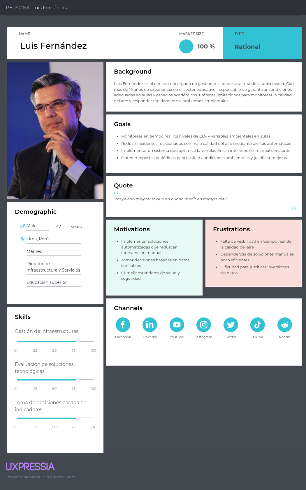

**Segmento 2: Instituciones Corporativas**

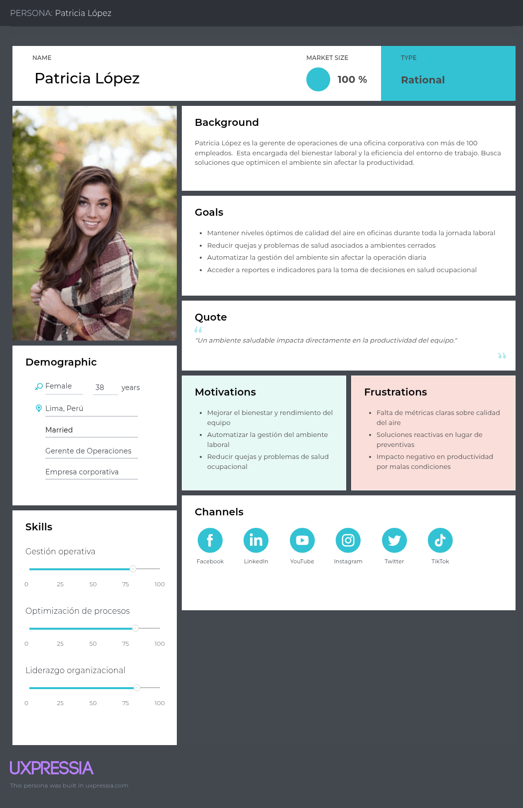

---

### 2.3.2. User Task Matrix

En esta sección, se presenta el User Task Matrix, que agrupa las principales tareas que los User Personas realizan para cumplir con sus objetivos. Los segmentos considerados para este análisis son:

1. Luis Fernández, director de infraestructura de una universidad, que busca una solución para mantener las aulas y otros espacios en la universidad saludables para los estudiantes y el personal académico.

2. Patricia López, gerente de operaciones de una empresa corporativa, que desea crear el mejor ambiente de trabajo posible para su equipo, garantizando un entorno saludable y productivo.

A continuación, se describen las tareas principales que ambos segmentos realizan independientemente de la existencia de nuestra aplicación de monitoreo de calidad del aire:

**Segmento 1**

| Tarea                                     | Frecuencia | Importancia |
| ----------------------------------------- | ---------- | ----------- |
| Monitorear calidad del aire en aulas      | Media      | Alta        |
| Recibir alertas de CO₂ alto               | Alta       | Alta        |
| Abrir ventanas o activar ventilación      | Media      | Alta        |
| Consultar reportes sobre calidad del aire | Baja       | Media       |

**Segmento 2**

| Tarea                               | Frecuencia | Importancia |
| ----------------------------------- | ---------- | ----------- |
| Revisar niveles de CO₂              | Media      | Alta        |
| Activar ventilación automáticamente | Media      | Alta        |
| Recibir alertas en tiempo real      | Alta       | Alta        |
| Generar reportes para RRHH/SSOMA    | Media      | Media       |
| Consultar histórico de datos        | Baja       | Media       |

---

### 2.3.3. Empathy Mapping

En esta sección se presentan los Empathy Mapping, esta herramienta nos ayudará a conocer un poco más lo que los usuarios sienten o necesitan de nuestra aplicación. 

**Segmento 1:**

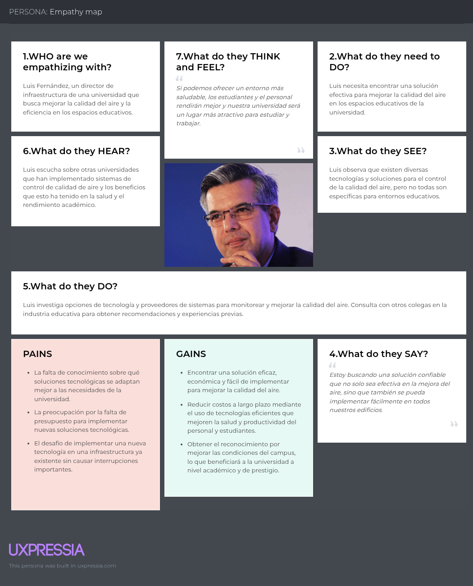

**Segmento 2:**

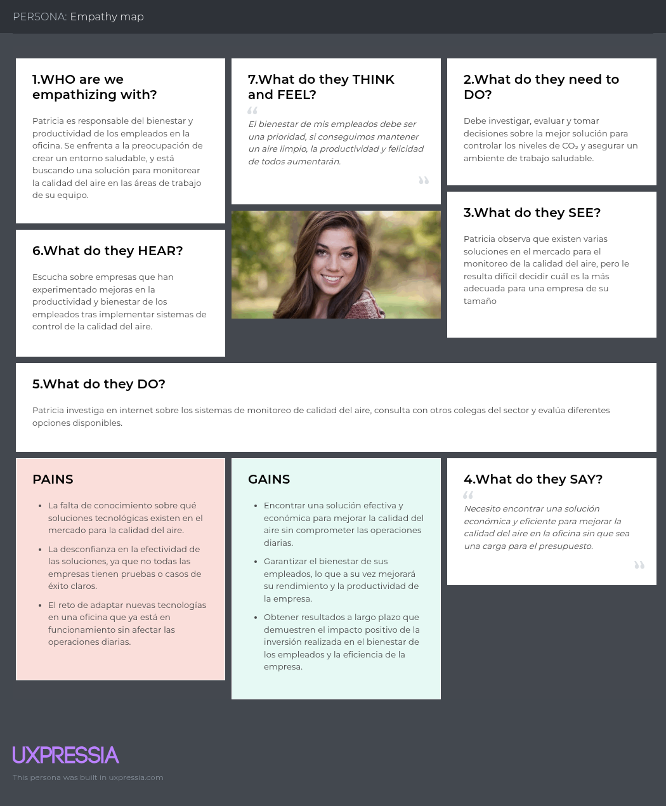

---

### 2.3.4. As-Is Scenario Mapping 

**Segmento 1**

**Segmento 2**

---

## 2.5. Ubiquitous Language

1. **Calidad del Aire:** El nivel de contaminantes o compuestos como CO₂, humedad, partículas en suspensión, y otros elementos que afectan la salud y el bienestar de los usuarios en espacios cerrados o exteriores.

2. **Sensor de Calidad de Aire:** Dispositivo que mide los niveles de CO₂, partículas y otros contaminantes en el aire para proporcionar datos en tiempo real a los usuarios.

3. **Monitoreo en Tiempo Real:** Capacidad de observar los niveles de calidad de aire en un espacio determinado de manera continua a través de la plataforma de Oxaira.

4. **Sistema de Ventilación Inteligente:** Sistema que ajusta automáticamente los niveles de ventilación y purificación en respuesta a los cambios en la calidad del aire, basado en los datos recogidos.

5. **Ambientes Saludables:**
Espacios en los que la calidad del aire está regulada y monitoreada constantemente para cumplir con los estándares de salud, lo que incluye niveles seguros de CO₂, humedad, y partículas en el aire.

---

# CAPÍTULO III: REQUIREMENTS SPECIFICATION

## 3.1. To-Be Scenario Mapping

**Segmento 1**

**Segmento 2**

## 3.2. User Stories

### Lista de User Stories
<table>
  <thead>
    <th><b>Title</b> Registro de usuario</th>
    <th><b>Priority</b> Alta</th>
    <th><b>Estimate</b> 3</th>
    <th><b>Story ID</b> HU001</th>
  </thead>
  <tr>
    <td colspan="4"><b>User Story:</b>   
       Como nuevo usuario de AirQ, quiero registrarme con mis datos personales y correo electrónico para poder crear una cuenta y acceder a la plataforma.
    </td>
  </tr>
  <tr>
    <td colspan="4">
      <b>Acceptance Criteria:</b> 
      - Escenario 1: Registro exitoso 
      <b>Dado</b> que el usuario quiere unirse a la plataforma, 
      <b>Cuando</b> complete el formulario con datos válidos, 
      <b>Entonces</b> se crea su cuenta y recibe un correo de confirmación.  
      - Escenario 2: Registro fallido 
      <b>Dado</b> que el usuario ingresa datos inválidos, 
      <b>Cuando</b> intente registrarse, 
      <b>Entonces</b> el sistema muestra mensajes de error claros.
    </td>
  </tr>
</table>
 

<table>
  <thead>
    <th><b>Title</b> Inicio de sesión</th>
    <th><b>Priority</b> Alta</th>
    <th><b>Estimate</b> 3</th>
    <th><b>Story ID</b> HU002</th>
  </thead>
  <tr>
    <td colspan="4"><b>User Story:</b>   
       Como usuario registrado de AirQ, quiero iniciar sesión con mi correo y contraseña, para acceder a mi cuenta de forma segura 
    </td>
  </tr>
  <tr>
    <td colspan="4">
      <b>Acceptance Criteria:</b> 
       - Escenario 1: Inicio exitoso 
      <b>Dado</b> que el usuario tiene credenciales correctas, 
      <b>Cuando</b> las ingrese y presione “Iniciar sesión”, 
      <b>Entonces</b> accede a su perfil y dashboard.   
       - Escenario 2: Inicio fallido 
      <b>Dado</b> que el usuario ingresa credenciales incorrectas, 
      <b>Cuando</b> intente iniciar sesión, 
      <b>Entonces</b> recibe un mensaje de error que indica “usuario o contraseña inválida”. 
    </td>
  </tr>
</table>
 

<table>
  <thead>
    <th><b>Title</b> Gestión de perfil de usuario</th>
    <th><b>Priority</b> Media</th>
    <th><b>Estimate</b> 5</th>
    <th><b>Story ID</b> HU003</th>
  </thead>
  <tr>
    <td colspan="4"><b>User Story:</b>   
       Como usuario autenticado de AirQ, quiero ver y editar mi información de perfil, para mantener mis datos actualizados 
    </td>
  </tr>
  <tr>
    <td colspan="4">
      <b>Acceptance Criteria:</b> 
       - Escenario 1: Visualización de perfil 
      <b>Dado</b> que el usuario ha iniciado sesión, 
      <b>Cuando</b> acceda a “Mi perfil”, 
      <b>Entonces</b> verá su información registrada.   
       - Escenario 2: Edición de perfil 
      <b>Dado</b> que el usuario desea actualizar sus datos, 
      <b>Cuando</b> haga clic en “Editar” y guarde cambios, 
      <b>Entonces</b> la nueva información se muestra correctamente en el perfil. 
    </td>
  </tr>
</table>
 

<table> 
    <thead> 
        <th><b>Title</b> Recepción de datos del sensor</th> 
        <th><b>Priority</b> Alta</th> 
        <th><b>Estimate</b> 5</th> 
        <th><b>Story ID</b> HU004</th> 
    </thead> 
    <tr> 
        <td colspan="4"><b>User Story:</b>  
            Como usuario de AirQ, quiero que el sistema reciba y registre datos de los sensores, para asegurar que la información esté disponible y sea confiable en la plataforma. 
        </td> 
    </tr>
    <tr> 
        <td colspan="4"> 
            <b>Acceptance Criteria:</b>  
            - Escenario 1: Recepción correcta  
            <b>Dado</b> que el sensor está encendido y vinculado,  
            <b>Cuando</b> envía datos,  
            <b>Entonces</b> el sistema los recibe y almacena correctamente.  
            - Escenario 2: Error en recepción  
            <b>Dado</b> que ocurre un fallo en la transmisión,  
            <b>Cuando</b> el sistema no recibe datos,  
            <b>Entonces</b> registra el error y mantiene la última información válida.     
        </td> 
    </tr> 
</table> 

 

<table> 
    <thead> 
        <th><b>Title</b> Visualización en tiempo real</th> 
        <th><b>Priority</b> Alta</th> 
        <th><b>Estimate</b> 8</th> 
        <th><b>Story ID</b> HU005</th> 
    </thead> 
    <tr> 
        <td colspan="4"><b>User Story:</b>  
            Como usuario de AirQ, quiero visualizar los datos de calidad de aire en tiempo real en el dashboard, para monitorear el estado del ambiente. 
        </td> 
    </tr>
    <tr> 
        <td colspan="4"> 
            <b>Acceptance Criteria:</b>  
            - Escenario 1:Visualización actualizada   
            <b>Dado</b> que existen datos recientes,  
            <b>Cuando</b> accedo al dashboard,  
            <b>Entonces</b> veo los valores actualizados sin retrasos perceptibles.  
            - Escenario 2:Datos visibles  
            <b>Dado</b> que hay múltiples variables,  
            <b>Cuando</b> se muestran en pantalla,  
            <b>Entonces</b> se visualizan de forma clara y organizada.
        </td> 
    </tr> 
</table> 

 

<table> 
    <thead> 
        <th><b>Title</b> Manejo de desconexión del sensor</th> 
        <th><b>Priority</b> Media</th> 
        <th><b>Estimate</b> 5</th> 
        <th><b>Story ID</b> HU006</th> 
    </thead> 
    <tr> 
        <td colspan="4"><b>User Story:</b>  
            Como usuario de AirQ, quiero ser informado cuando un sensor pierde conexión, para saber cuándo los datos pueden no ser confiables. 
        </td> 
    </tr>
    <tr> 
        <td colspan="4"> 
            <b>Acceptance Criteria:</b>  
            - Escenario 1: Sensor desconectado  
            <b>Dado</b> que el sensor pierde conexión,  
            <b>Cuando</b> el sistema intenta actualizar datos,  
            <b>Entonces</b> muestra un estado “Sin conexión”.  
            - Escenario 2: Última lectura  
            <b>Dado</b> que no hay conexión,  
            <b>Cuando</b> visualizo el dashboard,  
            <b>Entonces</b> se mantiene la última lectura disponible.        
        </td> 
    </tr> 
</table> 

 

<table> 
    <thead> 
        <th><b>Title</b> Consulta de historial de mediciones</th> 
        <th><b>Priority</b> Media</th> 
        <th><b>Estimate</b> 5</th> 
        <th><b>Story ID</b> HU007</th> 
    </thead> 
    <tr> 
        <td colspan="4"><b>User Story:</b>  
            Como usuario de AirQ, quiero consultar el historial de mediciones de calidad de aire, para analizar el comportamiento del ambiente en el tiempo. 
        </td> 
    </tr>
    <tr> 
        <td colspan="4"> 
            <b>Acceptance Criteria:</b>  
            - Escenario 1: Historial disponible  
            <b>Dado</b> que existen datos almacenados,  
            <b>Cuando</b> accedo al historial,   
            <b>Entonces</b> visualizo las mediciones con fecha y valores.  
            - Escenario 2: Orden de datos  
            <b>Dado</b> que hay múltiples registros,  
            <b>Cuando</b> se muestran,   
            <b>Entonces</b> están ordenados cronológicamente.  
        </td> 
    </tr> 
</table> 

 

<table> 
  <thead> 
    <th><b>Title</b> Control manual de dispositivos</th> 
    <th><b>Priority</b> Media</th> 
    <th><b>Estimate</b> 5</th> 
    <th><b>Story ID</b> HU008</th> 
  </thead> 
  <tr> 
    <td colspan="4"><b>User Story:</b>  
      Como usuario de AirQ, quiero poder activar manualmente los actuadores (ventilador, extractor), para intervenir en el control del ambiente cuando lo considere necesario, incluso si el sistema automático basado en Machine Learning está activo. 
    </td> 
  </tr>
  <tr> 
    <td colspan="4"> 
      <b>Acceptance Criteria:</b>  
      - Escenario 1: Activación manual  
      <b>Dado</b> que el dispositivo está disponible,  
      <b>Cuando</b> el usuario presiona activar manualmente,  
      <b>Entonces</b> el dispositivo cambia de estado correctamente, independientemente del estado del sistema automático.  
      - Escenario 2: Prioridad del control manual  
      <b>Dado</b> que el sistema automático está ejecutando una acción,  
      <b>Cuando</b> el usuario realiza una acción manual,  
      <b>Entonces</b> la acción manual tiene prioridad sobre la automática.  
      - Escenario 3: Error de conexión  
      <b>Dado</b> que el dispositivo está desconectado,  
      <b>Cuando</b> el usuario intenta activarlo,  
      <b>Entonces</b> el sistema muestra un mensaje de error indicando que no se pudo ejecutar la acción.
    </td> 
  </tr> 
</table>

 

<table> 
  <thead>
    <th><b>Title</b> Activación automática de dispositivos</th> 
    <th><b>Priority</b> Alta</th> 
    <th><b>Estimate</b> 8</th> 
    <th><b>Story ID</b> HU009</th>
  </thead> 
  <tr>
    <td colspan="4"><b>User Story:</b>  
      Como usuario de AirQ, quiero que el sistema active automáticamente dispositivos (ventilador, extractor) cuando la calidad del aire sea mala, para mantener condiciones adecuadas sin intervención manual. 
    </td>
  </tr>
  <tr> 
    <td colspan="4"> 
      <b>Acceptance Criteria:</b>  
      - Escenario 1: Activación automática  
      <b>Dado</b> que la calidad del aire supera un umbral definido,  
      <b>Cuando</b> el sistema lo detecta,  
      <b>Entonces</b> activa automáticamente el dispositivo correspondiente.  
      - Escenario 2: Condición normal  
      <b>Dado</b> que los niveles son adecuados,  
      <b>Cuando</b> el sistema evalúa el ambiente,  
      <b>Entonces</b> no realiza ninguna acción.
    </td>
  </tr> 
</table>

 

<table> 
  <thead>
    <th><b>Title</b> Evaluación de múltiples variables</th> 
    <th><b>Priority</b> Alta</th> 
    <th><b>Estimate</b> 8</th> 
    <th><b>Story ID</b> HU010</th>
  </thead> 
  <tr>
    <td colspan="4"><b>User Story:</b>  
      Como usuario de AirQ, quiero que el sistema considere múltiples variables (CO₂, PM2.5, temperatura, humedad), para tomar decisiones más precisas sobre el control del ambiente. 
    </td>
  </tr>
  <tr> 
    <td colspan="4"> 
      <b>Acceptance Criteria:</b>  
      - Escenario 1: Evaluación combinada  
      <b>Dado</b> que existen múltiples datos de sensores,  
      <b>Cuando</b> el sistema analiza el ambiente,  
      <b>Entonces</b> toma decisiones basadas en la combinación de variables.   
      - Escenario 2: Consistencia en decisiones  
      <b>Dado</b> que los valores cambian,  
      <b>Cuando</b> el sistema evalúa continuamente,  
      <b>Entonces</b> mantiene decisiones coherentes con las condiciones del ambiente.
    </td>
  </tr> 
</table>

 

<table> 
  <thead>
    <th><b>Title</b> Mejora continua del modelo</th> 
    <th><b>Priority</b> Media</th> 
    <th><b>Estimate</b> 8</th> 
    <th><b>Story ID</b> HU011</th>
  </thead> 
  <tr>
    <td colspan="4"><b>User Story:</b>  
      Como usuario de AirQ, quiero que el sistema ajuste sus decisiones automáticamente con el tiempo, para que el control del ambiente sea cada vez más preciso. 
    </td>
  </tr>
  <tr> 
    <td colspan="4"> 
      <b>Acceptance Criteria:</b>  
      - Escenario 1: Uso de datos históricos  
      <b>Dado</b> que el sistema acumula datos,  
      <b>Cuando</b> el modelo se actualiza,  
      <b>Entonces</b> mejora la precisión en la toma de decisiones.
    </td>
  </tr> 
</table>

   
 
 <table> 
    <thead> 
        <th><b>Title</b> Reportes periódicos de resultados</th> 
        <th><b>Priority</b> Media</th>
        <th><b>Estimate</b> 8</th> 
        <th><b>Story ID</b> HU012</th> 
    </thead> 
    <tr> 
      <td colspan="4"><b>User Story:</b>  
      Como usuario de AirQ, quiero recibir reportes con una frecuencia (diaria/semanal/mensual) que incluyan métricas y tendencias, para tomar decisiones informadas sobre salud y confort.
      </td> 
    </tr>
    <tr>
        <td colspan="4"> 
        <b>Acceptance Criteria:</b>  
        - Escenario 1: Configurar frecuencia  
        <b>Dado</b> que estoy en la sección “Reportes”,  
        <b>Cuando</b> selecciono “Semanal” y guardo,  
        <b>Entonces</b> la preferencia queda almacenada y se muestra la próxima fecha programada.  
        - Escenario 2: Generación y contenido mínimo  
        <b>Dado</b> que existen datos suficientes del periodo,  
        <b>Cuando</b> se genera el reporte semanal, 
        <b>Entonces</b> incluye promedio, máximo, mínimo por contaminante, gráficos de tendencia y recomendaciones si se superaron umbrales.  
        - Escenario 3: Distribución y descarga  
        <b>Dado</b> que la frecuencia es “Semanal” y hoy es la fecha de envío,  
        <b>Cuando</b> el reporte se publica,  
        <b>Entonces</b> lo recibo por correo y queda disponible en la app con opción de descarga en PDF y Excel.  
        - Escenario 4: Datos insuficientes  
        <b>Dado</b> que hay menos de 10 mediciones en el periodo,  
        <b>Cuando</b> se genera el reporte,  
        <b>Entonces</b> se muestra “Datos insuficientes para análisis” y no se calculan métricas agregadas. 
        </td> 
        </tr> 
 </table> 

   
<table> 
  <thead> 
    <th><b>Title</b> Notificaciones inteligentes de calidad del aire</th> 
    <th><b>Priority</b> Media</th> 
    <th><b>Estimate</b> 5</th> 
    <th><b>Story ID</b> HU013</th> 
  </thead> 
  <tr> 
    <td colspan="4"><b>User Story:</b>  
      Como usuario de AirQ, quiero recibir notificaciones inteligentes sobre la calidad del aire y las acciones ejecutadas automáticamente por el sistema basado en Machine Learning, para mantenerme informado del estado de mi ambiente sin necesidad de intervenir constantemente. 
    </td> 
  </tr> 
  <tr> 
    <td colspan="4"> 
      <b>Acceptance Criteria:</b>  
      - Escenario 1: Notificación por acción automática  
      <b>Dado</b> que el sistema detecta un nivel alto de contaminantes,  
      <b>Cuando</b> el modelo de Machine Learning ejecuta una acción (ej. encender ventilación),  
      <b>Entonces</b> el usuario recibe una notificación indicando la acción realizada y el motivo.  
      - Escenario 2: Retorno a condiciones normales  
      <b>Dado</b> que el ambiente vuelve a niveles seguros,  
      <b>Cuando</b> el sistema detecta estabilidad en los valores,  
      <b>Entonces</b> el usuario recibe una notificación indicando que la calidad del aire se ha normalizado.  
      - Escenario 3: Preferencias de notificación  
      <b>Dado</b> que el usuario configura sus preferencias,  
      <b>Cuando</b> ocurra un evento de calidad del aire o acción automática,  
      <b>Entonces</b> el sistema respeta sus configuraciones de notificación.  
      - Escenario 4: Control de notificaciones repetidas  
      <b>Dado</b> que múltiples eventos similares ocurren en corto tiempo,  
      <b>Cuando</b> el sistema genera notificaciones,  
      <b>Entonces</b> evita el envío de notificaciones duplicadas y agrupa los eventos relevantes. 
    </td> 
  </tr> 
</table>
    
 

<table>
  <thead>
    <th><b>Title</b> Chat con soporte</th>
    <th><b>Priority</b> Baja</th>
    <th><b>Estimate</b> 5</th>
    <th><b>Story ID</b> HU014</th>
  </thead>
  <tr>
    <td colspan="4"><b>User Story:</b>   
      Como usuario de AirQ, deseo poder acceder a una ventana de chat con personal de soporte para consultas personalizadas relacionadas con el dispositivo, para resolver dudas y solicitar apoyo en caso de averías.
    </td>
  </tr>
  <tr>
    <td colspan="4">
      <b>Acceptance Criteria:</b> 
      - Escenario 1: Acceso al chat exitoso 
      <b>Dado</b> que el usuario se encuentra en la pantalla principal, 
      <b>Cuando</b> haga clic en el botón “Soporte”, 
      <b>Entonces</b> se abrirá la ventana de chat que le permite enviar y recibir mensajes con soporte.  
      - Escenario 2: Acceso fallido 
      <b>Dado</b> que el servicio de chat no está disponible, 
      <b>Cuando</b> el usuario intente abrirlo, 
      <b>Entonces</b> el sistema mostrará un mensaje indicando “El chat no está disponible en este momento, inténtelo más tarde”.
    </td>
  </tr>
</table>
 

<table>
  <thead>
    <th><b>Title</b> FAQ</th>
    <th><b>Priority</b> Baja</th>
    <th><b>Estimate</b> 2</th>
    <th><b>Story ID</b> HU015</th>
  </thead>
  <tr>
    <td colspan="4"><b>User Story:</b>   
      Como usuario de AirQ, quiero acceder a una sección de preguntas frecuentes (FAQ), para resolver dudas comunes sin necesidad de contactar soporte.
    </td>
  </tr>
  <tr>
    <td colspan="4">
      <b>Acceptance Criteria:</b> 
      - Escenario 1: Visualización de preguntas frecuentes 
      <b>Dado</b> que el usuario accede a la sección de FAQ desde el menú, 
      <b>Cuando</b> la página cargue correctamente, 
      <b>Entonces</b> se muestran las preguntas y respuestas disponibles.  
      - Escenario 2: FAQ no disponible 
      <b>Dado</b> que el sistema tiene un problema de carga de contenido, 
      <b>Cuando</b> el usuario intente acceder, 
      <b>Entonces</b> se mostrará un mensaje de error indicando que “El contenido no está disponible temporalmente”.
    </td>
  </tr>
</table>
 

<table>
  <thead>
    <th><b>Title</b> Información de soporte</th>
    <th><b>Priority</b> Baja</th>
    <th><b>Estimate</b> 1</th>
    <th><b>Story ID</b> HU016</th>
  </thead>
  <tr>
    <td colspan="4"><b>User Story:</b>   
      Como usuario de AirQ, quiero visualizar la información de contacto del soporte (teléfono, correo, horarios de atención), para comunicarme de manera directa si lo necesito.
    </td>
  </tr>
  <tr>
    <td colspan="4">
      <b>Acceptance Criteria:</b> 
      - Escenario 1: Visualización correcta 
      <b>Dado</b> que el usuario accede a la sección de soporte, 
      <b>Cuando</b> se cargue la información, 
      <b>Entonces</b> verá los datos de contacto actualizados de soporte.  
      - Escenario 2: Información no disponible 
      <b>Dado</b> que el sistema no puede recuperar los datos, 
      <b>Cuando</b> el usuario ingrese a soporte, 
      <b>Entonces</b> se mostrará un mensaje indicando “La información de soporte no está disponible en este momento”.
    </td>
  </tr>
</table>
 

<table>
  <thead>
    <th><b>Title</b> Pasarela de pago</th>
    <th><b>Priority</b> Alta</th>
    <th><b>Estimate</b> 8</th>
    <th><b>Story ID</b> HU017</th>
  </thead>
  <tr>
    <td colspan="4"><b>User Story:</b> 
      Como usuario de AirQ, quiero realizar mis pagos a través de una pasarela segura, para completar mis compras o suscripciones de manera confiable.
    </td>
  </tr>
  <tr>
    <td colspan="4">
      <b>Acceptance Criteria:</b> 
      - Escenario 1: Acceso a pasarela 
      <b>Dado</b> que el usuario selecciona un plan o producto, 
      <b>Cuando</b> elija “Pagar”, 
      <b>Entonces</b> será redirigido a la pasarela de pago integrada.  
      - Escenario 2: Confirmación de pago 
      <b>Dado</b> que el usuario ingresa sus datos correctamente, 
      <b>Cuando</b> confirme la transacción, 
      <b>Entonces</b> recibirá un comprobante de pago válido.
    </td>
  </tr>
</table>
 

<table>
  <thead>
    <th><b>Title</b> Lista de suscripciones</th>
    <th><b>Priority</b> Media</th>
    <th><b>Estimate</b> 3</th>
    <th><b>Story ID</b> HU018</th>
  </thead>
  <tr>
    <td colspan="4"><b>User Story:</b> 
      Como usuario de AirQ, quiero visualizar el estado de mi servicio asociado al dispositivo, para saber si se encuentra activo y funcionando correctamente.
    </td>
  </tr>
  <tr>
    <td colspan="4">
      <b>Acceptance Criteria:</b> 
      - Escenario 1: Servicio activo 
      <b>Dado</b> que el usuario tiene un dispositivo instalado y una suscripción vigente, 
      <b>Cuando</b> accede a la sección “Estado del servicio”, 
      <b>Entonces</b> visualiza el estado “Activo”, el tipo de plan y la fecha de vencimiento.  
      - Escenario 2: Servicio vencido 
      <b>Dado</b> que la suscripción ha expirado, 
      <b>Cuando</b> accede a la sección “Estado del servicio”, 
      <b>Entonces</b> el sistema muestra el estado “Vencido” junto con la fecha de expiración y una alerta indicando que el servicio puede verse limitado.
        
      - Escenario 3: Servicio suspendido 
      <b>Dado</b> que existe un problema con el pago o incumplimiento, 
      <b>Cuando</b> el usuario accede a la sección, 
      <b>Entonces</b> el sistema muestra el estado “Suspendido” y una notificación indicando la causa.
        
      - Escenario 4: Error en la carga de información 
      <b>Dado</b> que ocurre un problema al obtener los datos del servicio, 
      <b>Cuando</b> el usuario accede a la sección, 
      <b>Entonces</b> el sistema muestra un mensaje indicando que la información no está disponible temporalmente.
    </td>
  </tr>
</table>
 

<table>
  <thead>
    <th><b>Title</b> Gestión de roles</th>
    <th><b>Priority</b> Alta</th>
    <th><b>Estimate</b> 5</th>
    <th><b>Story ID</b> HU019</th>
  </thead>
  <tr>
    <td colspan="4"><b>User Story:</b> 
      Como administrador, quiero asignar y gestionar roles de usuario, para controlar el acceso a funcionalidades como monitoreo, configuración del sistema y gestión de dispositivos IoT.
    </td>
  </tr>
  <tr>
    <td colspan="4">
      <b>Acceptance Criteria:</b> 
      - Escenario 1: Asignación de roles 
      <b>Dado</b> que el administrador gestiona usuarios, 
      <b>Cuando</b> edite un perfil, 
      <b>Entonces</b> podrá asignar un rol (ej. usuario, administrador, soporte).  
      - Escenario 2: Restricción por rol 
      <b>Dado</b> que un usuario tiene un rol específico, 
      <b>Cuando</b> intente acceder a funcionalidades restringidas (ej. configuración de dispositivos o gestión de usuarios), 
      <b>Entonces</b> el sistema validará si tiene permisos suficientes y bloqueará el acceso si no corresponde.
    </td>
  </tr>
</table>

 

<table>
  <thead>
    <th><b>Title</b> Historial de pagos</th>
    <th><b>Priority</b> Media</th>
    <th><b>Estimate</b> 3</th>
    <th><b>Story ID</b> HU020</th>
  </thead>
  <tr>
    <td colspan="4"><b>User Story:</b> 
      Como usuario de AirQ, quiero visualizar mi historial de pagos, para llevar un control de mis transacciones realizadas en la plataforma.
    </td>
  </tr>
  <tr>
    <td colspan="4">
      <b>Acceptance Criteria:</b> 
      - Escenario 1: Acceso a historial 
      <b>Dado</b> que el usuario está autenticado, 
      <b>Cuando</b> ingrese a “Historial de pagos”, 
      <b>Entonces</b> verá una lista con todas sus transacciones.  
      - Escenario 2: Detalle de transacción 
      <b>Dado</b> que el usuario consulta una transacción, 
      <b>Cuando</b> seleccione un registro, 
      <b>Entonces</b> visualizará la fecha, monto, método de pago y estado de la operación.
    </td>
  </tr>
</table>

 

<table>
  <thead>
    <tr>
      <th> Epic / Story ID</th>
      <th> Título</th>
      <th> Descripción</th>
      <th> Criterios de Aceptación</th>
    </tr>
    <tr>
      <td colspan="4">E1PIC-1: Autenticación y Gestión de Usuarios</td>
    </tr>
    <tr>
      <td>E1-HU001</td>
      <td>Registro de usuario</td>
      <td>Como nuevo usuario de AirQ, quiero registrarme con mis datos personales y correo electrónico para poder crear una cuenta y acceder a la plataforma.</td>
      <td>- Escenario 1: Registro exitoso 
      <b>Dado</b> que el usuario quiere unirse a la plataforma, 
      <b>Cuando</b> complete el formulario con datos válidos, 
      <b>Entonces</b> se crea su cuenta y recibe un correo de confirmación.  
      - Escenario 2: Registro fallido 
      <b>Dado</b> que el usuario ingresa datos inválidos, 
      <b>Cuando</b> intente registrarse, 
      <b>Entonces</b> el sistema muestra mensajes de error claros.</td>
    </tr>
    <tr>
      <td>E1-HU002</td>
      <td>Inicio de sesión</td>
      <td>Como usuario registrado de AirQ, quiero iniciar sesión con mi correo y contraseña, para acceder a mi cuenta de forma segura.</td>
      <td> - Escenario 1: Inicio exitoso 
      <b>Dado</b> que el usuario tiene credenciales correctas, 
      <b>Cuando</b> las ingrese y presione “Iniciar sesión”, 
      <b>Entonces</b> accede a su perfil y dashboard.   
       - Escenario 2: Inicio fallido 
      <b>Dado</b> que el usuario ingresa credenciales incorrectas, 
      <b>Cuando</b> intente iniciar sesión, 
      <b>Entonces</b> recibe un mensaje de error que indica “usuario o contraseña inválida”. </td>
    </tr>
    <tr>
      <td>E1-HU003</td>
      <td>Gestión de perfil de usuario</td>
      <td>Como usuario autenticado de AirQ, quiero ver y editar mi información de perfil, para mantener mis datos actualizados.</td>
      <td> - Escenario 1: Visualización de perfil 
      <b>Dado</b> que el usuario ha iniciado sesión, 
      <b>Cuando</b> acceda a “Mi perfil”, 
      <b>Entonces</b> verá su información registrada.   
       - Escenario 2: Edición de perfil 
      <b>Dado</b> que el usuario desea actualizar sus datos, 
      <b>Cuando</b> haga clic en “Editar” y guarde cambios, 
      <b>Entonces</b> la nueva información se muestra correctamente en el perfil. </td>
    </tr>
    <tr>
      <td>E1-HU019</td>
      <td>Gestión de roles</td>
      <td>Como administrador, quiero asignar y gestionar roles de usuario, para controlar el acceso a funcionalidades como monitoreo, configuración del sistema y gestión de dispositivos IoT.</td>
      <td>- Escenario 1: Asignación de roles 
      <b>Dado</b> que el administrador gestiona usuarios, 
      <b>Cuando</b> edite un perfil, 
      <b>Entonces</b> podrá asignar un rol (ej. usuario, administrador, soporte).  
      - Escenario 2: Restricción por rol 
      <b>Dado</b> que un usuario tiene un rol específico, 
      <b>Cuando</b> intente acceder a funcionalidades restringidas (ej. configuración de dispositivos o gestión de usuarios), 
      <b>Entonces</b> el sistema validará si tiene permisos suficientes y bloqueará el acceso si no corresponde.</td>
    </tr>
    <tr>
      <td colspan="4">EPIC-2: Ingreso y Monitoreo de Datos IoT</td>
    </tr>
    <tr>
      <td>E2-HU004</td>
      <td>Recepción de datos del sensor</td>
      <td>Como usuario de AirQ, quiero que el sistema reciba y registre datos de los sensores, para asegurar que la información esté disponible y sea confiable en la plataforma.</td>
      <td>- Escenario 1: Recepción correcta  
      <b>Dado</b> que el sensor está encendido y vinculado,  
      <b>Cuando</b> envía datos,  
      <b>Entonces</b> el sistema los recibe y almacena correctamente.  
      - Escenario 2: Error en recepción  
      <b>Dado</b> que ocurre un fallo en la transmisión,  
      <b>Cuando</b> el sistema no recibe datos,  
      <b>Entonces</b> registra el error y mantiene la última información válida.</td>
    </tr>
    <tr>
      <td>E2-HU005</td>
      <td>Visualización en tiempo real</td>
      <td>Como usuario de AirQ, quiero visualizar los datos de calidad de aire en tiempo real en el dashboard, para monitorear el estado del ambiente.</td>
      <td><b>Acceptance Criteria:</b>  
      - Escenario 1:Visualización actualizada   
      <b>Dado</b> que existen datos recientes,  
      <b>Cuando</b> accedo al dashboard,  
      <b>Entonces</b> veo los valores actualizados sin retrasos perceptibles.  
      - Escenario 2:Datos visibles  
      <b>Dado</b> que hay múltiples variables,  
      <b>Cuando</b> se muestran en pantalla,  
      <b>Entonces</b> se visualizan de forma clara y organizada.</td>
    </tr>
    <tr>
      <td>E2-HU006</td>
      <td>Manejo de desconexión del sensor</td>
      <td>Como usuario de AirQ, quiero ser informado cuando un sensor pierde conexión, para saber cuándo los datos pueden no ser confiables.</td>
      <td>- Escenario 1: Sensor desconectado  
      <b>Dado</b> que el sensor pierde conexión,  
      <b>Cuando</b> el sistema intenta actualizar datos,  
      <b>Entonces</b> muestra un estado “Sin conexión”.  
      - Escenario 2: Última lectura  
      <b>Dado</b> que no hay conexión,  
      <b>Cuando</b> visualizo el dashboard,  
      <b>Entonces</b> se mantiene la última lectura disponible.    </td>
    </tr>
    <tr>
      <td>E2-HU007</td>
      <td>Consulta de historial de mediciones</td>
      <td>Como usuario de AirQ, quiero consultar el historial de mediciones de calidad de aire, para analizar el comportamiento del ambiente en el tiempo.</td>
      <td>- Escenario 1: Historial disponible  
      <b>Dado</b> que existen datos almacenados,  
      <b>Cuando</b> accedo al historial,   
      <b>Entonces</b> visualizo las mediciones con fecha y valores.  
      - Escenario 2: Orden de datos  
      <b>Dado</b> que hay múltiples registros,  
      <b>Cuando</b> se muestran,   
      <b>Entonces</b> están ordenados cronológicamente.  </td>
    </tr>
    <tr>
      <td colspan="4">EPIC-3: Control y Automatización del Ambiente</td>
    </tr>
    <tr>
      <td>E3-HU008</td>
      <td>Control manual de dispositivos</td>
      <td>Como usuario de AirQ, quiero poder activar manualmente los actuadores (ventilador, extractor), para intervenir en el control del ambiente cuando lo considere necesario, incluso si el sistema automático basado en Machine Learning está activo.</td>
      <td>- Escenario 1: Activación manual  
      <b>Dado</b> que el dispositivo está disponible,  
      <b>Cuando</b> el usuario presiona activar manualmente,  
      <b>Entonces</b> el dispositivo cambia de estado correctamente, independientemente del estado del sistema automático.  
      - Escenario 2: Prioridad del control manual  
      <b>Dado</b> que el sistema automático está ejecutando una acción,  
      <b>Cuando</b> el usuario realiza una acción manual,  
      <b>Entonces</b> la acción manual tiene prioridad sobre la automática.  
      - Escenario 3: Error de conexión  
      <b>Dado</b> que el dispositivo está desconectado,  
      <b>Cuando</b> el usuario intenta activarlo,  
      <b>Entonces</b> el sistema muestra un mensaje de error indicando que no se pudo ejecutar la acción.</td>
    </tr>
    <tr>
      <td>E3-HU009</td>
      <td>Activación automática de dispositivos</td>
      <td>Como usuario de AirQ, quiero que el sistema active automáticamente dispositivos (ventilador, extractor) cuando la calidad del aire sea mala, para mantener condiciones adecuadas sin intervención manual.</td>
      <td>- Escenario 1: Activación automática  
      <b>Dado</b> que la calidad del aire supera un umbral definido,  
      <b>Cuando</b> el sistema lo detecta,  
      <b>Entonces</b> activa automáticamente el dispositivo correspondiente.  
      - Escenario 2: Condición normal  
      <b>Dado</b> que los niveles son adecuados,  
      <b>Cuando</b> el sistema evalúa el ambiente,  
      <b>Entonces</b> no realiza ninguna acción.</td>
    </tr>
    <tr>
      <td>E3-HU010</td>
      <td>Evaluación de múltiples variables</td>
      <td>Como usuario de AirQ, quiero que el sistema considere múltiples variables (CO₂, PM2.5, temperatura, humedad), para tomar decisiones más precisas sobre el control del ambiente.</td>
      <td>- Escenario 1: Evaluación combinada  
      <b>Dado</b> que existen múltiples datos de sensores,  
      <b>Cuando</b> el sistema analiza el ambiente,  
      <b>Entonces</b> toma decisiones basadas en la combinación de variables.   
      - Escenario 2: Consistencia en decisiones  
      <b>Dado</b> que los valores cambian,  
      <b>Cuando</b> el sistema evalúa continuamente,  
      <b>Entonces</b> mantiene decisiones coherentes con las condiciones del ambiente.</td>
    </tr>
    <tr>
      <td>E3-HU011</td>
      <td>Mejora continua del modelo</td>
      <td>Como usuario de AirQ, quiero que el sistema ajuste sus decisiones automáticamente con el tiempo, para que el control del ambiente sea cada vez más preciso.</td>
      <td>- Escenario 1: Uso de datos históricos  
      <b>Dado</b> que el sistema acumula datos,  
      <b>Cuando</b> el modelo se actualiza,  
      <b>Entonces</b> mejora la precisión en la toma de decisiones.</td>
    </tr>
    <tr>
      <td colspan="4">EPIC-4: Analítica y Notificaciones</td>
    </tr>
    <tr>
      <td>E4-HU012</td>
      <td>Reportes periódicos de resultados</td>
      <td>Como usuario de AirQ, quiero recibir reportes con una frecuencia (diaria/semanal/mensual) que incluyan métricas y tendencias, para tomar decisiones informadas sobre salud y confort.</td>
      <td>- Escenario 1: Configurar frecuencia  
      <b>Dado</b> que estoy en la sección “Reportes”,  
      <b>Cuando</b> selecciono “Semanal” y guardo,  
      <b>Entonces</b> la preferencia queda almacenada y se muestra la próxima fecha programada.  
      - Escenario 2: Generación y contenido mínimo  
      <b>Dado</b> que existen datos suficientes del periodo,  
      <b>Cuando</b> se genera el reporte semanal, 
      <b>Entonces</b> incluye promedio, máximo, mínimo por contaminante, gráficos de tendencia y recomendaciones si se superaron umbrales.  
      - Escenario 3: Distribución y descarga  
      <b>Dado</b> que la frecuencia es “Semanal” y hoy es la fecha de envío,  
      <b>Cuando</b> el reporte se publica,  
      <b>Entonces</b> lo recibo por correo y queda disponible en la app con opción de descarga en PDF y Excel.  
      - Escenario 4: Datos insuficientes  
      <b>Dado</b> que hay menos de 10 mediciones en el periodo,  
      <b>Cuando</b> se genera el reporte,  
      <b>Entonces</b> se muestra “Datos insuficientes para análisis” y no se calculan métricas agregadas. </td>
    </tr>
    <tr>
      <td>E4-HU013</td>
      <td>Notificaciones inteligentes de calidad del aire</td>
      <td>Como usuario de AirQ, quiero recibir notificaciones inteligentes sobre la calidad del aire y las acciones ejecutadas automáticamente por el sistema basado en Machine Learning, para mantenerme informado del estado de mi ambiente sin necesidad de intervenir constantemente.</td>
      <td>- Escenario 1: Notificación por acción automática  
      <b>Dado</b> que el sistema detecta un nivel alto de contaminantes,  
      <b>Cuando</b> el modelo de Machine Learning ejecuta una acción (ej. encender ventilación),  
      <b>Entonces</b> el usuario recibe una notificación indicando la acción realizada y el motivo.  
      - Escenario 2: Retorno a condiciones normales  
      <b>Dado</b> que el ambiente vuelve a niveles seguros,  
      <b>Cuando</b> el sistema detecta estabilidad en los valores,  
      <b>Entonces</b> el usuario recibe una notificación indicando que la calidad del aire se ha normalizado.  
      - Escenario 3: Preferencias de notificación  
      <b>Dado</b> que el usuario configura sus preferencias,  
      <b>Cuando</b> ocurra un evento de calidad del aire o acción automática,  
      <b>Entonces</b> el sistema respeta sus configuraciones de notificación.  
      - Escenario 4: Control de notificaciones repetidas  
      <b>Dado</b> que múltiples eventos similares ocurren en corto tiempo,  
      <b>Cuando</b> el sistema genera notificaciones,  
      <b>Entonces</b> evita el envío de notificaciones duplicadas y agrupa los eventos relevantes. </td>
    </tr>
    <tr>
      <td colspan="4">EPIC-5: Soporte al Usuario</td>
    </tr>
    <tr>
      <td>E5-HU014</td>
      <td>Chat con soporte</td>
      <td>Como usuario de AirQ, deseo poder acceder a una ventana de chat con personal de soporte para consultas personalizadas relacionadas con el dispositivo, para resolver dudas y solicitar apoyo en caso de averías.</td>
      <td>- Escenario 1: Acceso al chat exitoso 
      <b>Dado</b> que el usuario se encuentra en la pantalla principal, 
      <b>Cuando</b> haga clic en el botón “Soporte”, 
      <b>Entonces</b> se abrirá la ventana de chat que le permite enviar y recibir mensajes con soporte.  
      - Escenario 2: Acceso fallido 
      <b>Dado</b> que el servicio de chat no está disponible, 
      <b>Cuando</b> el usuario intente abrirlo, 
      <b>Entonces</b> el sistema mostrará un mensaje indicando “El chat no está disponible en este momento, inténtelo más tarde”.</td>
    </tr>
    <tr>
      <td>E5-HU015</td>
      <td>FAQ</td>
      <td>Como usuario de AirQ, quiero acceder a una sección de preguntas frecuentes (FAQ), para resolver dudas comunes sin necesidad de contactar soporte.</td>
      <td>- Escenario 1: Visualización de preguntas frecuentes 
      <b>Dado</b> que el usuario accede a la sección de FAQ desde el menú, 
      <b>Cuando</b> la página cargue correctamente, 
      <b>Entonces</b> se muestran las preguntas y respuestas disponibles.  
      - Escenario 2: FAQ no disponible 
      <b>Dado</b> que el sistema tiene un problema de carga de contenido, 
      <b>Cuando</b> el usuario intente acceder, 
      <b>Entonces</b> se mostrará un mensaje de error indicando que “El contenido no está disponible temporalmente”.</td>
    </tr>
    <tr>
      <td>E5-HU016</td>
      <td>Información de soporte</td>
      <td>Como usuario de AirQ, quiero visualizar la información de contacto del soporte (teléfono, correo, horarios de atención), para comunicarme de manera directa si lo necesito</td>
      <td>- Escenario 1: Visualización correcta 
      <b>Dado</b> que el usuario accede a la sección de soporte, 
      <b>Cuando</b> se cargue la información, 
      <b>Entonces</b> verá los datos de contacto actualizados de soporte.  
      - Escenario 2: Información no disponible 
      <b>Dado</b> que el sistema no puede recuperar los datos, 
      <b>Cuando</b> el usuario ingrese a soporte, 
      <b>Entonces</b> se mostrará un mensaje indicando “La información de soporte no está disponible en este momento”.</td>
    </tr>
    <tr>
      <td colspan="4">EPIC-6: Pagos y Suscripciones</td>
    </tr>
    <tr>
      <td>E6-HU017</td>
      <td>Pasarela de pago</td>
      <td>Como usuario de AirQ, quiero realizar mis pagos a través de una pasarela segura, para completar mis compras o suscripciones de manera confiable.</td>
      <td>- Escenario 1: Acceso a pasarela 
      <b>Dado</b> que el usuario selecciona un plan o producto, 
      <b>Cuando</b> elija “Pagar”, 
      <b>Entonces</b> será redirigido a la pasarela de pago integrada.  
      - Escenario 2: Confirmación de pago 
      <b>Dado</b> que el usuario ingresa sus datos correctamente, 
      <b>Cuando</b> confirme la transacción, 
      <b>Entonces</b> recibirá un comprobante de pago válido.</td>
    </tr>
    <tr>
      <td>E6-HU018</td>
      <td>Visualización del estado del servicio</td>
      <td>Como usuario de AirQ, quiero visualizar el estado de mi servicio asociado al dispositivo, para saber si se encuentra activo y funcionando correctamente.</td>
      <td>- Escenario 1: Servicio activo 
      <b>Dado</b> que el usuario tiene un dispositivo instalado y una suscripción vigente, 
      <b>Cuando</b> accede a la sección “Estado del servicio”, 
      <b>Entonces</b> visualiza el estado “Activo”, el tipo de plan y la fecha de vencimiento.  
      - Escenario 2: Servicio vencido 
      <b>Dado</b> que la suscripción ha expirado, 
      <b>Cuando</b> accede a la sección “Estado del servicio”, 
      <b>Entonces</b> el sistema muestra el estado “Vencido” junto con la fecha de expiración y una alerta indicando que el servicio puede verse limitado.
        
      - Escenario 3: Servicio suspendido 
      <b>Dado</b> que existe un problema con el pago o incumplimiento, 
      <b>Cuando</b> el usuario accede a la sección, 
      <b>Entonces</b> el sistema muestra el estado “Suspendido” y una notificación indicando la causa.
        
      - Escenario 4: Error en la carga de información 
      <b>Dado</b> que ocurre un problema al obtener los datos del servicio, 
      <b>Cuando</b> el usuario accede a la sección, 
      <b>Entonces</b> el sistema muestra un mensaje indicando que la información no está disponible temporalmente.</td>
    </tr>
    <tr>
      <td>E6-HU020</td>
      <td>Historial de pagos</td>
      <td>Como usuario de AirQ, quiero visualizar mi historial de pagos, para llevar un control de mis transacciones realizadas en la plataforma.</td>
      <td>- Escenario 1: Acceso a historial 
      <b>Dado</b> que el usuario está autenticado, 
      <b>Cuando</b> ingrese a “Historial de pagos”, 
      <b>Entonces</b> verá una lista con todas sus transacciones.  
      - Escenario 2: Detalle de transacción 
      <b>Dado</b> que el usuario consulta una transacción, 
      <b>Cuando</b> seleccione un registro, 
      <b>Entonces</b> visualizará la fecha, monto, método de pago y estado de la operación.</td>
    </tr>
  </thead>
</table>

## 3.3. Impact Mapping

**Segmento 1:**

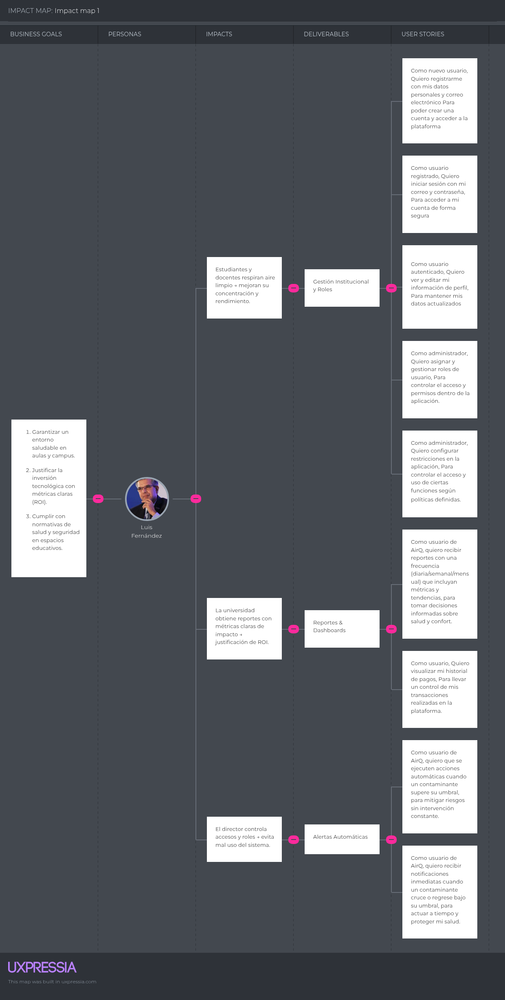

**Segmento 2:**

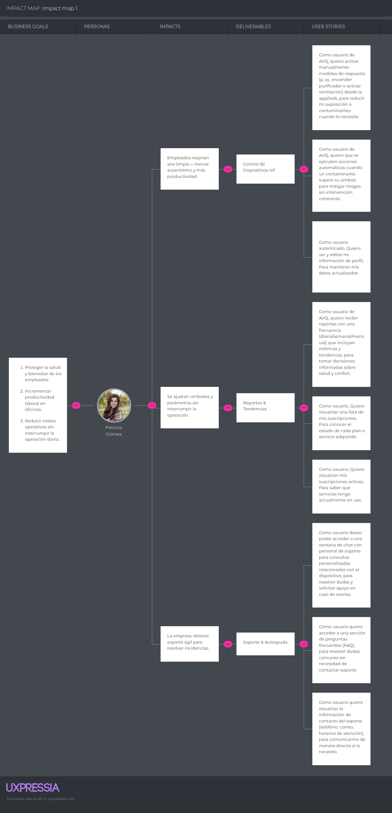

## 3.4. Product Backlog

| Orden| User Story / Technical Story Id  | Título             | Descripción                                                                | Story Points|
|------|-----------------|-------------------------------------|----------------------------------------------------------------------------|-------------|
| 1    | E1-HU001        | Registro de usuario                 |Como nuevo usuario de AirQ, quiero registrarme con mis datos personales y correo electrónico para poder crear una cuenta y acceder a la plataforma.| 3           |
| 2    | E1-HU002        | Inicio de sesión                    |Como usuario registrado de AirQ, quiero iniciar sesión con mi correo y contraseña, para acceder a mi cuenta de forma segura| 3           |
| 3    | E6-HU017        | Pasarela de pago                    |Como usuario de AirQ, quiero realizar mis pagos a través de una pasarela segura, para completar mis compras o suscripciones de manera confiable.| 8           |
| 4    | E6-HU018        | Estado del servicio                 |Como usuario de AirQ, quiero visualizar el estado de mi servicio asociado al dispositivo, para saber si se encuentra activo y funcionando correctamente.| 3           |
| 5    | E2-HU004        | Recepción de datos del sensor       |Como usuario de AirQ, quiero que el sistema reciba y registre datos de los sensores, para asegurar que la información esté disponible y sea confiable en la plataforma.| 5           |
| 6    | E2-HU005        | Visualización en tiempo real        |Como usuario de AirQ, quiero visualizar los datos de calidad de aire en tiempo real en el dashboard, para monitorear el estado del ambiente.| 8           |
| 7    | E2-HU006        | Manejo de desconexión               |Como usuario de AirQ, quiero ser informado cuando un sensor pierde conexión, para saber cuándo los datos pueden no ser confiables.| 5           |
| 8    | E3-HU009        | Activación automática               |Como usuario de AirQ, quiero que el sistema active automáticamente dispositivos (ventilador, extractor) cuando la calidad del aire sea mala, para mantener condiciones adecuadas sin intervención manual.| 8           |
| 9    | E3-HU008        | Control manual                      |Como usuario de AirQ, quiero poder activar manualmente los actuadores (ventilador, extractor), para intervenir en el control del ambiente cuando lo considere necesario, incluso si el sistema automático basado en Machine Learning está activo.| 5           |
| 10   | E3-HU010        | Evaluación de múltiples variables   |Como usuario de AirQ, quiero que el sistema considere múltiples variables (CO₂, PM2.5, temperatura, humedad), para tomar decisiones más precisas sobre el control del ambiente.| 8           |
| 11   | E3-HU011        | Mejora del modelo                   |Como usuario de AirQ, quiero que el sistema ajuste sus decisiones automáticamente con el tiempo, para que el control del ambiente sea cada vez más preciso.| 8           |
| 12   | E2-HU007        | Historial de mediciones             |Como usuario de AirQ, quiero consultar el historial de mediciones de calidad de aire, para analizar el comportamiento del ambiente en el tiempo.| 5           |
| 13   | E4-HU012        | Reportes periódicos                 |Como usuario de AirQ, quiero recibir reportes con una frecuencia (diaria/semanal/mensual) que incluyan métricas y tendencias, para tomar decisiones informadas sobre salud y confort.| 8           |
| 14   | E4-HU013        | Notificaciones inteligentes         |Como usuario de AirQ, quiero recibir notificaciones inteligentes sobre la calidad del aire y las acciones ejecutadas automáticamente por el sistema basado en Machine Learning, para mantenerme informado del estado de mi ambiente sin necesidad de intervenir constantemente.| 5           |
| 15   | E1-HU003        | Gestión de perfil                   |Como usuario autenticado de AirQ, quiero ver y editar mi información de perfil, para mantener mis datos actualizados| 5           |
| 16   | E6-HU020        | Historial de pagos                  |Como usuario de AirQ, quiero visualizar mi historial de pagos, para llevar un control de mis transacciones realizadas en la plataforma.| 3           |
| 17   | E1-HU019        | Gestión de roles                    |Como administrador, quiero asignar y gestionar roles de usuario, para controlar el acceso a funcionalidades como monitoreo, configuración del sistema y gestión de dispositivos IoT.| 5           |
| 18   | E5-HU014        | Chat con soporte                    |Como usuario de AirQ, deseo poder acceder a una ventana de chat con personal de soporte para consultas personalizadas relacionadas con el dispositivo, para resolver dudas y solicitar apoyo en caso de averías.| 5           |
| 19   | E5-HU015        | FAQ                                 |Como usuario de AirQ, quiero acceder a una sección de preguntas frecuentes (FAQ), para resolver dudas comunes sin necesidad de contactar soporte.| 2           |
| 20   | E5-HU016        | Información de soporte              |Como usuariode AirQ, quiero visualizar la información de contacto del soporte (teléfono, correo, horarios de atención), para comunicarme de manera directa si lo necesito.| 1           |

---

# CAPÍTULO IV: STRATEGIC-LEVEL SOFTWARE DESIGN

---

## 4.1. Strategic-Level Attribute-Driven Design

### 4.1.1. Design Purpose

El propósito del diseño arquitectónico de la solución AirQ es definir una arquitectura escalable, distribuida y orientada a eventos que permita:

- Procesar datos en tiempo real provenientes de sensores IoT  
- Garantizar alta disponibilidad y baja latencia en la visualización  
- Soportar múltiples dispositivos y usuarios concurrentes  
- Permitir la integración de modelos de Machine Learning  

Este diseño responde directamente a la problemática identificada en el Capítulo II, donde los usuarios requieren información inmediata y acciones automáticas frente a la calidad del aire.

---

### 4.1.2. Attribute-Driven Design Inputs

---

#### 4.1.2.1. Primary Functionality

Las siguientes User Stories han sido seleccionadas como drivers principales de arquitectura debido a su impacto en la solución:

| ID    | Título                   | Descripción                            |
| ----- | ------------------------ | -------------------------------------- |
| HU004 | Monitoreo en tiempo real | Recepción y visualización de datos IoT |
| HU006 | Automatización           | Ejecución de acciones automáticas      |
| HU008 | Notificaciones           | Alertas en tiempo real                 |
| HU007 | Reportes                 | Generación de métricas y análisis      |

Estas historias definen:
- Flujo de datos
- Procesamiento en tiempo real
- Interacción sistema-usuario

---

#### 4.1.2.2. Quality Attribute Scenarios

| Atributo     | Fuente     | Estímulo               | Artefacto   | Entorno          | Respuesta                  | Medida               |
| ------------ | ---------- | ---------------------- | ----------- | ---------------- | -------------------------- | -------------------- |
| Performance  | Sensor IoT | Envío de datos         | Backend API | Operación normal | Procesa y muestra datos    | < 2 segundos         |
| Availability | Usuario    | Acceso al sistema      | Web App     | Alta demanda     | Sistema responde sin caída | 99.5% uptime         |
| Scalability  | Sistema    | Incremento de sensores | Backend     | Alta carga       | Escala horizontalmente     | +1000 dispositivos   |
| Reliability  | Sensor     | Pérdida de conexión    | Sistema     | Error            | Mantiene último dato       | Sin pérdida de datos |
| Security     | Usuario    | Inicio de sesión       | API         | Internet         | Autenticación segura       | JWT + cifrado        |

---

#### 4.1.2.3. Constraints

| ID    | Título                   | Descripción                                     |
| ----- | ------------------------ | ----------------------------------------------- |
| TC001 | Uso de IoT               | El sistema debe integrarse con sensores físicos |
| TC002 | Arquitectura distribuida | Backend debe ser desacoplado                    |
| TC003 | Cloud deployment         | Debe desplegarse en la nube                     |
| TC004 | RESTful APIs             | Comunicación basada en APIs                     |
| TC005 | Multi-plataforma         | Web + Mobile                                    |

---

### 4.1.3. Architectural Drivers Backlog

Drivers principales:

- Procesamiento en tiempo real  
- Alta disponibilidad  
- Escalabilidad  
- Integración IoT  
- Automatización  

Estos drivers guían TODAS las decisiones arquitectónicas.

---

### 4.1.4. Architectural Design Decisions

| Decisión                              | Justificación                          |
| ------------------------------------- | -------------------------------------- |
| Arquitectura basada en microservicios | Permite escalabilidad independiente    |
| Uso de APIs REST                      | Facilita integración entre componentes |
| Arquitectura orientada a eventos      | Ideal para IoT y datos en tiempo real  |
| Uso de cloud (AWS/Firebase)           | Alta disponibilidad                    |
| Base de datos híbrida                 | SQL + NoSQL                            |

---

### 4.1.5. Quality Attribute Scenario Refinements

Refinamiento:

- Performance: uso de WebSockets  
- Scalability: uso de contenedores (Docker)  
- Availability: balanceadores de carga  
- Security: autenticación JWT  

---

## 4.2. Strategic-Level Domain-Driven Design

---

### 4.2.1. EventStorming

Para la elaboración del EventStorming, el equipo se organizó para encontrar una primera aproximación almodelado del dominio de nuestro proyecto.

Más detalle en: [Miro](https://miro.com/app/board/uXjVJF8TGBw=/?share_link_id=973173365533)

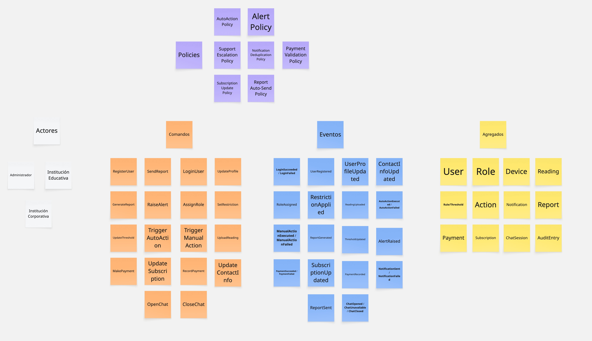

---

### 4.2.2. Candidate Context Discovery.

A partir del EventStorming realizado en Miro, nuestro equipo llevó a cabo una sesión de Candidate ContextDiscovery para identificar los bounded contexts de nuestra solución. Utilizamos principalmente la técnicalook-for-pivotal-events durante la sesión.

| Contexto candidato                   | Descripción (alcance del dominio)                                                                                                                | Historias de Usuario que lo sustentan |
| ------------------------------------ | ------------------------------------------------------------------------------------------------------------------------------------------------ | ------------------------------------- |
| **Identity & Access (IAM)**          | Registro, inicio/cierre de sesión, recuperación/cambio de contraseña, gestión de perfil/contacto. Provee identidad y `claims` a todo el sistema. | US001, US002, US003, US018            |
| **Gestión de Roles & Restricciones** | Administración de roles (usuario, admin, soporte) y políticas de acceso por plan de suscripción.                                                 | US015, US019                          |
| **IoT & Control de Respuesta**       | Ingesta de datos desde dispositivos, ejecución de acciones manuales/automáticas y edición de parámetros de respuesta.                            | US005, US006, US008, US009            |
| **Notificaciones**                   | Envío de alertas inmediatas, recordatorios y retorno a nivel seguro con antispam/debounce.                                                       | US008                                 |
| **Reportes & Insights**              | Generación y distribución de reportes (PDF/Excel) con métricas y tendencias periódicas.                                                          | US007                                 |
| **Facturación & Suscripciones**      | Pasarela de pago, listado de suscripciones, historial de pagos, estado de suscripciones activas.                                                 | US013, US014, US016, US017            |
| **Soporte & Autoayuda**              | Atención al usuario vía chat, FAQ y datos de contacto de soporte.                                                                                | US010, US011, US012                   |

---

### 4.2.3. Domain Message Flows Modeling

Los Domain Message Flows modelan las interacciones entre los diferentes bounded contexts, mostrandocómo se comunican entre sí mediante comandos, eventos y consultas. A continuación, presentamos los flujosde mensaje para cuatro escenarios clave de nuestra aplicación:

| Comando               | Evento(s) resultante(s)                       | Productor             | Consumidor(es)                   |
| --------------------- | --------------------------------------------- | --------------------- | -------------------------------- |
| `RegisterUser`        | `UserRegistered`                              | IAM                   | Roles & Restricciones, Auditoría |
| `LoginUser`           | `LoginSucceeded` / `LoginFailed`              | IAM                   | Auditoría                        |
| `UpdateProfile`       | `UserProfileUpdated`                          | IAM                   | Auditoría                        |
| `UpdateContactInfo`   | `ContactInfoUpdated`                          | IAM                   | Notificaciones                   |
| `AssignRole`          | `RoleAssigned`                                | Roles & Restricciones | IAM, Auditoría                   |
| `SetRestriction`      | `RestrictionApplied`                          | Roles & Restricciones | Frontend, Auditoría              |
| `UploadReading`       | `ReadingUploaded`                             | IoT                   | Reglas, Reportes                 |
| `TriggerManualAction` | `ManualActionExecuted` / `ManualActionFailed` | IoT                   | Auditoría, Historial             |
| `TriggerAutoAction`   | `AutoActionExecuted` / `AutoActionFailed`     | IoT                   | Notificaciones, Auditoría        |
| `UpdateThreshold`     | `ThresholdUpdated`                            | IoT                   | Auditoría                        |
| `RaiseAlert`          | `AlertRaised`                                 | IoT/Notificaciones    | Usuario, Auditoría               |
| `GenerateReport`      | `ReportGenerated`                             | Reportes              | Usuario, Notificaciones          |
| `SendReport`          | `ReportSent`                                  | Reportes              | Usuario, Auditoría               |
| `MakePayment`         | `PaymentSucceeded` / `PaymentFailed`          | Facturación           | Suscripciones, Auditoría         |
| `UpdateSubscription`  | `SubscriptionUpdated`                         | Suscripciones         | Frontend, Notificaciones         |
| `RecordPayment`       | `PaymentRecorded`                             | Facturación           | Auditoría                        |
| `OpenChat`            | `ChatOpened`                                  | Soporte               | Auditoría                        |
| `ChatFailed`          | `ChatUnavailable`                             | Soporte               | Auditoría                        |

---

### 4.2.4. Bounded Context Canvases

Los Bounded Context Canvases son herramientas visuales que nos permiten documentar las característicasfundamentales de cada contexto delimitado, capturando su propósito estratégico, modelo de dominio,lenguaje ubicuo, políticas y relaciones con otros contextos. A continuación, presentamos los canvases paranuestros cuatro bounded contexts identificados, que nos ayudaron a definir claramente las responsabilidadesy límites de cada uno.

| Contexto                             | Propósito                                                                            | Responsabilidades principales                                                       | Entidades / Aggregates                   | Eventos emitidos                                                                         |
| ------------------------------------ | ------------------------------------------------------------------------------------ | ----------------------------------------------------------------------------------- | ---------------------------------------- | ---------------------------------------------------------------------------------------- |
| **Identity & Access (IAM)**          | Autenticar/autorizar usuarios y gestionar perfiles.                                  | Registro, login/logout, recuperación de credenciales, edición de datos de contacto. | User, Credential, Session, ContactInfo   | UserRegistered, LoginSucceeded, LoginFailed, UserProfileUpdated, ContactInfoUpdated      |
| **Gestión de Roles & Restricciones** | Asignar roles y aplicar restricciones por suscripción/rol.                           | Gestión de permisos, control de features premium.                                   | Role, RestrictionPolicy                  | RoleAssigned, RestrictionApplied                                                         |
| **IoT & Control de Respuesta**       | Gestionar dispositivos, ingesta de lecturas, ejecutar acciones manuales/automáticas. | Lecturas, umbrales, reglas, historial de acciones.                                  | Device, Reading, Rule, Action, Threshold | ReadingUploaded, ManualActionExecuted, AutoActionExecuted, ThresholdUpdated, AlertRaised |
| **Notificaciones**                   | Comunicar alertas, recordatorios y retornos a seguro.                                | Push/email, antispam, preferencias de usuario.                                      | Notification, Alert, Reminder            | AlertRaised, NotificationSent, NotificationFailed                                        |
| **Reportes & Insights**              | Componer y distribuir reportes periódicos.                                           | Generación de PDF/Excel, almacenamiento histórico.                                  | Report, Metric                           | ReportGenerated, ReportSent                                                              |
| **Facturación & Suscripciones**      | Procesar pagos y controlar suscripciones.                                            | Transacciones, historial, planes activos.                                           | Payment, Subscription                    | PaymentSucceeded, SubscriptionUpdated, PaymentRecorded                                   |
| **Soporte & Autoayuda**              | Resolver dudas de usuarios vía chat/FAQ.                                             | Chat, base de FAQs, datos de contacto.                                              | ChatSession, FAQEntry                    | ChatOpened, ChatUnavailable                                                              |
---

### 4.2.5. Context Mapping

Después de identificar nuestros bounded contexts a través del EventStorming, procedimos a analizar lasrelaciones entre ellos para desarrollar un context mapping efectivo. Este proceso fue crucial para entendercómo los diferentes contextos interactúan entre sí y para definir claramente sus responsabilidades y límites

| Origen (Upstream)         | Destino (Downstream) | Tipo de relación        | Estilo de integración      | Motivo/Contrato                                          |
| ------------------------- | -------------------- | ----------------------- | -------------------------- | -------------------------------------------------------- |
| **IAM**                   | Todos                | Conformist              | OIDC/JWT + Webhooks        | Todos aceptan identidad/claims tal como IAM los publica. |
| **Roles & Restricciones** | Frontend             | Customer/Supplier       | REST + JWT Claims          | Habilita/limita funcionalidades según rol/plan.          |
| **IoT**                   | Reportes             | Customer/Supplier       | Stream de lecturas + ETL   | Datos crudos procesados en métricas/insights.            |
| **IoT**                   | Notificaciones       | Partnership             | Pub/Sub eventos `alert.*`  | SLA de baja latencia para alertas críticas.              |
| **Facturación**           | Suscripciones        | Customer/Supplier + ACL | REST + eventos `billing.*` | Estado de pago actualiza features habilitados.           |
| **Reportes**              | Notificaciones       | Customer/Supplier       | Evento `report.ready`      | Aviso de disponibilidad de reporte.                      |
| **Soporte**               | IAM                  | Conformist              | REST                       | Chat vinculado a identidad del usuario.                  |
| **Todos**                 | Auditoría            | Conformist              | Event-sourcing ligero      | Trazabilidad completa.                                   |

---

## Diagrama lógico
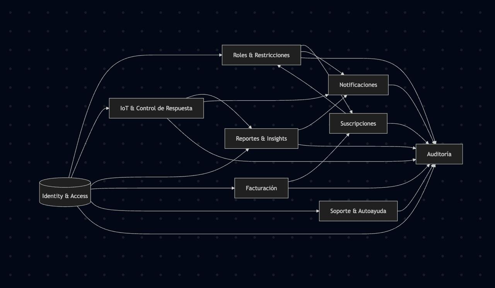

## 4.3. Software Architecture

---

### 4.3.1. Software Architecture System Landscape Diagram

  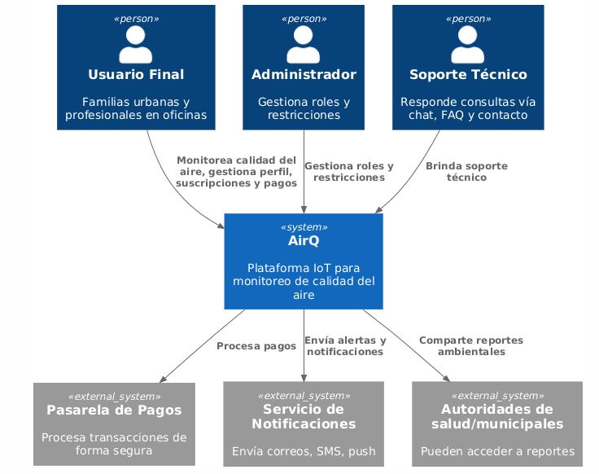

---

### 4.3.2. Software Architecture Context Level Diagram

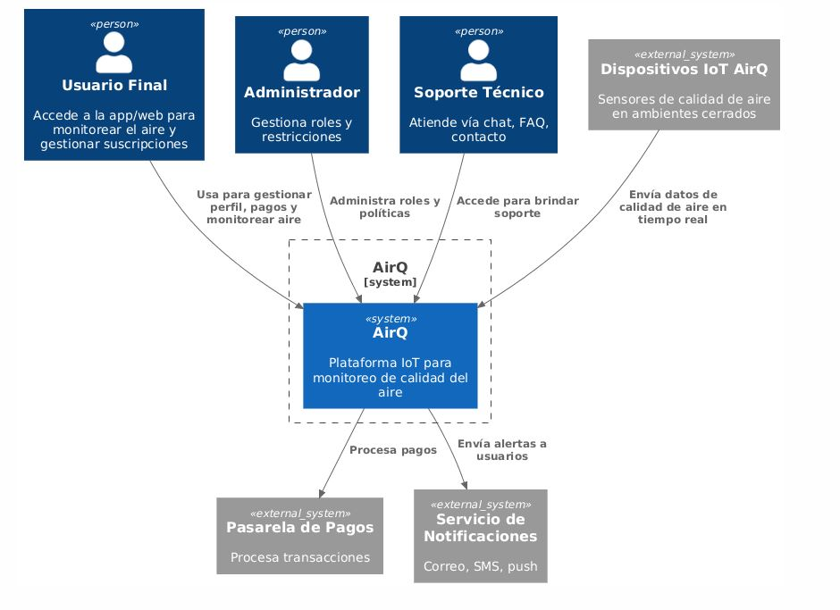

---

### 4.3.3. Software Architecture Container Level Diagram

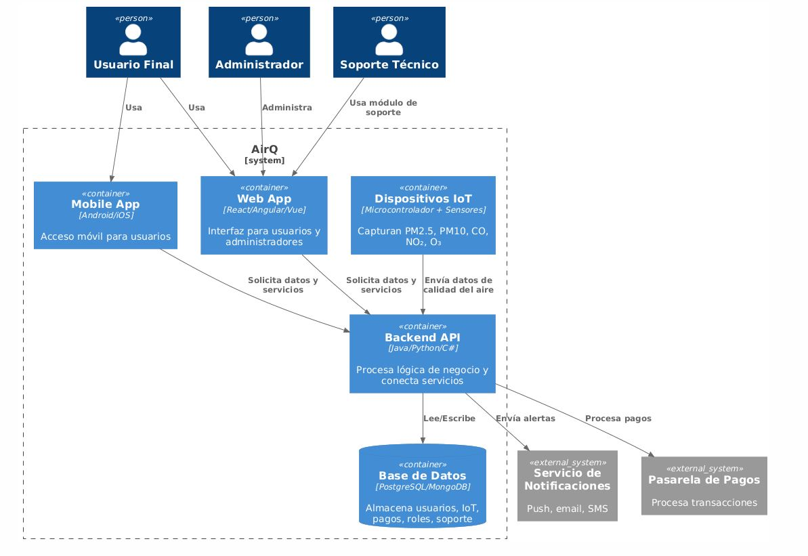

---

### 4.3.4. Software Architecture Deployment Diagram

Infraestructura:

- Cloud (AWS / Firebase)
- Contenedores Docker
- API Gateway
- Bases de datos
- Servicios IoT

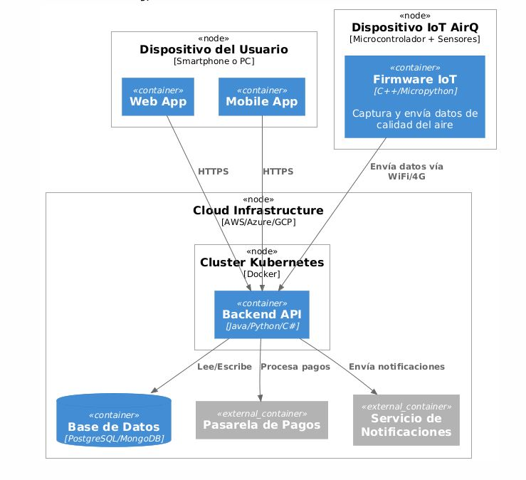

---

# Conclusiones

A partir del desarrollo del proyecto AirQ, se puede concluir que la integración de tecnologías emergentes como Internet of Things (IoT) y Machine Learning permite abordar de manera efectiva problemáticas reales relacionadas con la calidad del aire en espacios cerrados, especialmente en contextos urbanos como Lima.

En primer lugar, el proceso de investigación (Capítulo II) permitió validar que existe una necesidad real en los segmentos objetivo (instituciones educativas y corporativas), evidenciando que los usuarios carecen de herramientas que les permitan monitorear y actuar frente a la calidad del aire en tiempo real. Esto confirmó la relevancia del problema y justificó el desarrollo de la solución.

En segundo lugar, la especificación de requerimientos (Capítulo III) permitió estructurar la solución desde una perspectiva centrada en el usuario, utilizando artefactos como User Stories, Impact Mapping y Product Backlog. Estos elementos facilitaron la priorización de funcionalidades clave como monitoreo en tiempo real, alertas automáticas y generación de reportes.

Asimismo, el diseño arquitectónico (Capítulo IV), basado en Attribute-Driven Design (ADD) y Domain-Driven Design (DDD), permitió definir una arquitectura escalable, modular y orientada a eventos, adecuada para el procesamiento de datos IoT en tiempo real. La identificación de drivers arquitectónicos y atributos de calidad como rendimiento, disponibilidad y escalabilidad fue fundamental para tomar decisiones tecnológicas coherentes con los objetivos del sistema.

Por otro lado, se concluye que el uso de una arquitectura distribuida basada en microservicios y el despliegue en la nube permiten garantizar la escalabilidad del sistema y su adaptación a diferentes contextos de implementación, desde instituciones educativas hasta empresas.

Finalmente, el desarrollo del proyecto permitió al equipo fortalecer competencias en análisis de requerimientos, diseño de arquitectura de software, trabajo colaborativo y comunicación técnica, alineándose con el Student Outcome del curso.

Como recomendación, se propone en futuras iteraciones:

- Implementar modelos de Machine Learning más avanzados para predicción de calidad del aire  
- Integrar el sistema con dispositivos de automatización (smart devices)  
- Ampliar el alcance hacia ciudades inteligentes (smart cities)  
- Realizar validaciones con usuarios reales mediante prototipos funcionales  

En conclusión, AirQ representa una solución tecnológica viable, escalable y alineada con las necesidades actuales de monitoreo ambiental, con potencial de impacto en la salud, productividad y bienestar de las personas.

---

# Bibliografía

- Ministerio del Ambiente del Perú. (2023). *Calidad del aire en el Perú*.  
  https://www.gob.pe/minam

- Bass, L., Clements, P., & Kazman, R. (2012). *Software architecture in practice* (3rd ed.). Addison-Wesley.  
  https://www.pearson.com/en-us/subject-catalog/p/software-architecture-in-practice/P200000003295

- Evans, E. (2003). *Domain-driven design: Tackling complexity in the heart of software*. Addison-Wesley.  
  https://www.oreilly.com/library/view/domain-driven-design-tackling/0321125215/

- Fowler, M. (2018). *Microservices architecture*.  
  https://martinfowler.com/microservices/

- Humble, J., & Farley, D. (2010). *Continuous delivery: Reliable software releases through build, test, and deployment automation*. Addison-Wesley.  
  https://www.oreilly.com/library/view/continuous-delivery-reliable/9780321670250/

- International Organization for Standardization. (2021). *ISO 16000: Indoor air quality standards*.  
  https://www.iso.org/standard/39170.html

- Newman, S. (2021). *Building microservices* (2nd ed.). O’Reilly Media.  
  https://www.oreilly.com/library/view/building-microservices-2nd/9781492034018/

- United States Environmental Protection Agency. (2023). *Indoor air quality*.  
  https://www.epa.gov/indoor-air-quality-iaq

- World Health Organization. (2021). *WHO global air quality guidelines*.  
  https://www.who.int/publications/i/item/9789240034228

- Amazon Web Services. (2024). *IoT architecture best practices*.  
  https://aws.amazon.com/iot/

- Microsoft. (2024). *Azure architecture center*.  
  https://learn.microsoft.com/en-us/azure/architecture/

- Google. (2024). *Machine learning crash course*.  
  https://developers.google.com/machine-learning

- UXPressia. (2024). *Customer journey mapping tools*.  
  https://uxpressia.com/

- Institute of Electrical and Electronics Engineers. (2022). *Internet of Things (IoT): Architecture and design*.  
  https://www.ieee.org/

